# Hướng dẫn từng bước: tạo báo cáo "Báo cáo nhanh doanh thu" cho Lãnh đạo Tập đoàn (LDTD) và HCRC

File này ĐỘC LẬP, đủ để làm từ đầu đến cuối không cần mở file khác — gồm cả
VIEW SQL, thao tác trên giao diện (kèm ảnh), và nguyên khối `DefinitionJson`
để dán thẳng vào rp-user. Phần giải thích kiến trúc/lý do kỹ thuật sâu hơn
(vì sao 2 domain riêng, các domain DSMART16 khác ngoài 2 báo cáo này...) xem
thêm `hướng_dẫn_báo_cáo.md` mục 11/15 — nhưng không bắt buộc phải đọc để
làm theo file này.

**DSMART16 thật ra là 2 CSDL riêng** — `DSMART16` (dữ liệu ĐANG PHÁT SINH
trong tháng hiện tại, "Live") và `DSMART16_EOM` (dữ liệu các tháng ĐÃ ĐÓNG
sổ trong quá khứ — "End Of Month"). Vì cột "Cùng kỳ năm trước"/"Tỷ lệ %
LFL" của báo cáo cần dữ liệu 1 NĂM TRƯỚC — chắc chắn không còn nằm trong
`DSMART16` (DB Live chỉ giữ tháng hiện tại) mà nằm trong `DSMART16_EOM` —
nên phải đọc dữ liệu doanh thu/giao dịch từ **CẢ 2 CSDL**, không phải 1.
May mắn là kiến trúc ETL đã có sẵn cơ chế đúng cho việc này (mục 11
`hướng_dẫn_báo_cáo.md` gọi đây là mô hình "2 nguồn Live + Lịch sử") — chỉ
cần tạo 2 "Nguồn dữ liệu" (1 trỏ `DSMART16`, 1 trỏ `DSMART16_EOM`) rồi tạo
2 Sync Job CÙNG 1 Domain cho mỗi loại số liệu (1 job đọc Live, 1 job đọc
Lịch sử) — dữ liệu 2 nguồn tự động ghép thành 1 dải liên tục khi báo cáo
chạy, không cần cấu hình gì thêm ở phía rp-user. Xem chi tiết ở Bước 2.

> **Lưu ý về ảnh minh hoạ**: ảnh chụp dưới đây lấy từ ĐÚNG giao diện thật
> của etl-admin/rp-user (không phải hình vẽ tay), nhưng dữ liệu hiển thị
> (tên nguồn, số liệu chỉ tiêu, danh sách báo cáo...) là **dữ liệu mẫu**
> dựng trong môi trường thử nghiệm — không phải dữ liệu thật của DSMART16.
> Bố cục nút bấm/ô nhập là chính xác 100%; tên/số bạn thấy khi làm thật sẽ
> khác (đúng theo dữ liệu bạn có).

---

## Tổng quan các bước

1. Tạo 2 VIEW — **trên CẢ 2 CSDL** `DSMART16` và `DSMART16_EOM` (làm ở SQL
   Server Management Studio hoặc công cụ quản trị CSDL — KHÔNG phải trên
   giao diện web).
2. etl-admin → **Nguồn dữ liệu**: khai 2 kết nối (Live + Lịch sử) →
   **Đồng bộ**: tạo 4 job đồng bộ (Doanh thu × 2 nguồn, Giao dịch × 2
   nguồn — mỗi cặp CÙNG 1 Domain để tự ghép).
3. etl-admin → **Chỉ tiêu Lãnh đạo Tập đoàn** / **Chỉ tiêu HCRC**: nhập file
   chỉ tiêu tháng cho từng bên.
4. rp-user → **Hệ thống → Biểu mẫu**: tạo 2 báo cáo (LDTD, HCRC) bằng
   `DefinitionJson`.
5. rp-user → **Hệ thống → Phân quyền**: gán quyền xem đúng báo cáo cho đúng
   nhóm.
6. rp-user → **Hệ thống → Lịch gửi email báo cáo**: đặt lịch gửi tự động
   (không bắt buộc).
7. Kiểm tra lại.

---

## Bước 1 — Tạo VIEW trên CẢ 2 CSDL DSMART16 (làm trước, ngoài giao diện web)

"Ngoài giao diện web" nghĩa là chạy trực tiếp trên CSDL DSMART16 bằng 1
công cụ quản trị SQL Server — KHÔNG phải vào etl-admin/rp-user (2 trang đó
cố tình không có chỗ gõ SQL tuỳ ý, chỉ duyệt bảng/cột có sẵn, vì lý do an
toàn).

**Công cụ**: SQL Server Management Studio (SSMS — phổ biến nhất, tải miễn
phí từ Microsoft) hoặc Azure Data Studio. Dùng bản IT/DBA đã cài sẵn nếu có.

**Các bước cụ thể — LẶP LẠI Y HỆT CHO CẢ 2 CSDL** (`DSMART16` rồi
`DSMART16_EOM` — 2 lượt Connect + New Query + Execute riêng, VIEW là object
CỦA TỪNG CSDL, tạo ở CSDL này không tự có ở CSDL kia dù cùng 1 máy chủ):

1. Mở SSMS → hộp thoại "Connect to Server" hiện ra:
   - **Server name**: địa chỉ máy chủ SQL Server đang chạy DSMART16 (hỏi
     DBA/IT nếu chưa biết — thường dạng `192.168.x.x` hoặc
     `tenmaychu\SQLEXPRESS`). Thường CẢ 2 CSDL nằm CHUNG 1 máy chủ, chỉ
     khác tên Database — nếu vậy chỉ cần Connect 1 lần, đổi CSDL ở bước 2.
   - **Authentication**: SQL Server Authentication → nhập Username/Password
     của **tài khoản có quyền tạo VIEW** trên CSDL đó.
   - Bấm **Connect**.
2. Cây bên trái (Object Explorer) → mở rộng **Databases** → chọn CSDL
   `DSMART16` (lượt đầu) hoặc `DSMART16_EOM` (lượt sau).
3. Bấm **New Query** (hoặc `Ctrl+N`) — mở cửa sổ soạn thảo trống, đang trỏ
   đúng CSDL vừa chọn ở bước 2 (kiểm tra lại ô chọn Database ở thanh công
   cụ phía trên cửa sổ Query, ngay cạnh nút Execute — chọn NHẦM CSDL sẽ
   tạo VIEW vào sai chỗ mà không báo lỗi gì).
4. Dán nguyên 2 câu `CREATE VIEW...` dưới đây (nhớ điền đúng 2 mã
   `STYPE_ID` thật của MART/MINIMART trước khi chạy — xem chú thích ngay
   dưới 2 câu lệnh).
5. Bấm **Execute** (hoặc phím `F5`). Không có dòng lỗi đỏ ở khung kết quả
   phía dưới là thành công.
6. Kiểm tra: mở rộng CSDL đó → mục **Views** → thấy đủ
   `V_HCRC_DOANHTHU_CHINHANH` và `V_HCRC_GIAODICH_CHINHANH` trong danh sách.
7. Lặp lại đúng bước 2-6 cho CSDL còn lại.

**Về quyền — ai nên làm bước này**: tài khoản chạy `CREATE VIEW` ở đây
KHÁC tài khoản sẽ khai ở etl-admin (mục "Nguồn dữ liệu", Bước 2 dưới) —
tài khoản khai ở etl-admin chỉ nên **CHỈ ĐỌC** (SELECT), không đủ quyền tạo
VIEW. Vì vậy bước này thường là việc của **DBA/IT quản trị DSMART16** — gửi
2 đoạn SQL này cho họ chạy giúp nếu bạn không có tài khoản quyền cao hơn.
Sau khi VIEW đã tồn tại, tài khoản chỉ-đọc dùng ở etl-admin cần được cấp
thêm quyền `SELECT` trên đúng 2 VIEW đó (DBA cấp quyền, không cần quyền tạo
VIEW).

**VIEW có tồn tại mãi mãi không?** Có — `CREATE VIEW` tạo ra 1 object lưu
CỐ ĐỊNH trong CSDL (giống như tạo 1 bảng), KHÔNG tự hết hạn, KHÔNG mất khi
khởi động lại máy chủ SQL Server, KHÔNG cần chạy lại. VIEW chỉ mất đi nếu
có ai đó chủ động chạy `DROP VIEW <tên>`. Cần lưu ý 2 điều:

- VIEW **không lưu dữ liệu riêng** — nó chỉ là 1 câu `SELECT` đã lưu sẵn
  tên. Mỗi lần job đồng bộ (Bước 2) đọc VIEW, SQL Server tự chạy LẠI câu
  `SELECT` đó trên dữ liệu THẬT MỚI NHẤT của `DSTK_INFO`/`TRANSHDR`/
  `STOCK`/`COSTPRICE` — không phải đọc số liệu cũ đã "chụp" từ lúc tạo VIEW.
- Nếu sau này DBA đổi cấu trúc 1 trong 4 bảng nguồn (đổi tên cột, xoá cột
  đang dùng trong VIEW...), VIEW sẽ báo lỗi khi chạy — cần sửa lại câu
  `CREATE VIEW` (dùng `ALTER VIEW` để sửa, không cần xoá tạo lại) cho khớp
  cấu trúc mới. Việc này hiếm khi xảy ra với 1 hệ thống đã ổn định như
  DSMART16.

```sql
-- VIEW 1: Doanh thu + Lãi gộp + Diện tích + Nhóm chuỗi, gộp theo (chi nhánh, ngày)
CREATE VIEW V_HCRC_DOANHTHU_CHINHANH AS
SELECT
    d.STK_ID, d.WORK_DATE,
    SUM(d.TOCUST_QTY) AS SoLuongBan,
    SUM(d.TOCUST_AMT) AS doanhThu,
    SUM(d.TOCUST_VAT) AS TienVAT,
    SUM(d.TOCUST_DIS) AS TienGiamGia,
    SUM(d.TOCUST_COM) AS HoaHong,
    SUM(d.TOCUST_AMT) - SUM(d.TOCUST_QTY * ISNULL(c.COSTPRICE, 0)) AS laiGop,
    MAX(s.DIMENSION) AS dienTich,
    MAX(CASE WHEN s.STYPE_ID = '<mã MART thật>' THEN 'MART'
             WHEN s.STYPE_ID = '<mã MINIMART thật>' THEN 'MINIMART'
             ELSE s.STYPE_ID END) AS chain
FROM DSTK_INFO d
JOIN STOCK s
    ON s.STK_ID = d.STK_ID
LEFT JOIN COSTPRICE c
    ON c.STK_ID = d.STK_ID AND c.SKU_ID = d.SKU_ID
   AND c.MEC_YM = LEFT(CONVERT(char(8), d.WORK_DATE, 112), 6)
GROUP BY d.STK_ID, d.WORK_DATE;
GO

-- VIEW 2: Số giao dịch, gộp theo (chi nhánh, ngày) — BU_ID chưa phải mã chuẩn,
-- sẽ quy đổi ở Bước 2 bằng "Ánh xạ mã chi nhánh"
CREATE VIEW V_HCRC_GIAODICH_CHINHANH AS
SELECT BU_ID, CAST(TRAN_DATE AS DATE) AS TRAN_DATE,
       COUNT(*) AS SoGiaoDich, SUM(AMOUNT) AS TongTien,
       SUM(DISCOUNT) AS TongGiamGia, SUM(VAT_AMT) AS TongVAT
FROM TRANSHDR
WHERE STATUS <> 'X' -- đối chiếu đúng mã STATUS "đã huỷ" thật với DBA DSMART16
GROUP BY BU_ID, CAST(TRAN_DATE AS DATE);
GO
```

**Trước khi chạy thật, cần xác nhận 3 điều với DBA DSMART16** (chưa xác
nhận được từ file schema, chỉ là dự đoán hợp lý theo tên cột):

1. `STOCK.STYPE_ID` — cột phân loại MART/MINIMART. Chạy thử
   `SELECT DISTINCT STYPE_ID FROM STOCK` để biết 2 mã thật, điền vào chỗ
   `'<mã MART thật>'`/`'<mã MINIMART thật>'` ở trên.
2. `COSTPRICE.MEC_YM` — định dạng tháng (giả định `YYYYMM`, vd `'202609'`).
   Nếu sai định dạng, cột Lãi gộp sẽ ra sai (coi giá vốn = 0) mà KHÔNG báo
   lỗi gì — xem cách phát hiện ở Bước 7.
3. **`DSMART16_EOM` có đủ bảng `STOCK`/`COSTPRICE` không?** — VIEW doanh thu
   JOIN thêm 2 bảng "danh mục" này (tên siêu thị/diện tích/giá vốn), vốn ít
   khi cần lưu lại theo từng tháng quá khứ — có khả năng `DSMART16_EOM` CHỈ
   lưu 2 bảng "phát sinh" (`DSTK_INFO`/`TRANSHDR`), KHÔNG có `STOCK`/
   `COSTPRICE`. Chạy thử `SELECT TOP 1 * FROM STOCK` trên `DSMART16_EOM`
   trước khi chạy `CREATE VIEW` ở đó:
   - **Có bảng, chạy được** → dùng nguyên VIEW dưới đây, không cần sửa.
   - **Báo lỗi "Invalid object name 'STOCK'"** → 2 bảng đó chỉ có ở
     `DSMART16` (Live). Nếu 2 CSDL nằm CHUNG 1 máy chủ SQL Server, sửa VIEW
     bên `DSMART16_EOM` để tham chiếu CHÉO sang `DSMART16` bằng tên đủ 3
     phần (`<TênCSDL>.<schema>.<bảng>`), đổi `JOIN STOCK s` thành
     `JOIN DSMART16.dbo.STOCK s` và `LEFT JOIN COSTPRICE c` thành
     `LEFT JOIN DSMART16.dbo.COSTPRICE c` (chỉ 2 chỗ này, phần còn lại giữ
     nguyên) — vẫn hợp lệ vì cùng máy chủ, không cần Linked Server. Diện
     tích/nhóm chuỗi vốn ít đổi nên dùng bản MỚI NHẤT ở `DSMART16` cho cả
     dữ liệu quá khứ là hợp lý; riêng giá vốn (`COSTPRICE`) đã tự khớp
     đúng tháng qua điều kiện `MEC_YM` sẵn có trong câu JOIN, không bị ảnh
     hưởng bởi việc bảng nằm ở CSDL nào.
   - Nếu 2 CSDL nằm **KHÁC máy chủ** — báo lại cho DBA, cần hướng xử lý
     khác (Linked Server hoặc đồng bộ riêng bảng danh mục), ngoài phạm vi
     hướng dẫn này.

---

## Bước 2 — etl-admin: khai 2 Nguồn dữ liệu + tạo 4 job đồng bộ

Vì DSMART16 là **2 CSDL riêng** (`DSMART16` Live + `DSMART16_EOM` Lịch sử
— xem giải thích ở đầu file), mỗi loại số liệu (Doanh thu, Giao dịch) cần
**2 job** — 1 đọc CSDL Live, 1 đọc CSDL Lịch sử, CÙNG 1 Domain để tự ghép
lại thành 1 dải liên tục khi báo cáo chạy. Tổng cộng **4 job**, không phải
2.

### 2.1 — Khai 2 "Nguồn dữ liệu"

Vào etl-admin, menu **"Nguồn dữ liệu"** (sidebar bên trái). Điền form 2
lần, mỗi lần 1 kết nối:

**Nguồn 1 — Live**:
- **Tên nguồn**: "DSMART16 - Live".
- **Loại**: SQL Server.
- **Server**: địa chỉ máy chủ SQL Server (giống bước 1).
- **Database**: `DSMART16`.
- **Username/Password**: tài khoản **CHỈ ĐỌC** (SELECT) — KHÔNG dùng tài
  khoản đã tạo VIEW ở Bước 1 (tài khoản đó quyền rộng hơn cần thiết).
- Bấm **"Kiểm tra kết nối"** trước, thấy ✅ mới bấm **"Lưu nguồn dữ liệu"**.

**Nguồn 2 — Lịch sử**: y hệt, chỉ đổi **Tên nguồn**: "DSMART16 - Lịch sử",
**Database**: `DSMART16_EOM`.

Sau khi lưu cả 2, danh sách hiện như sau:

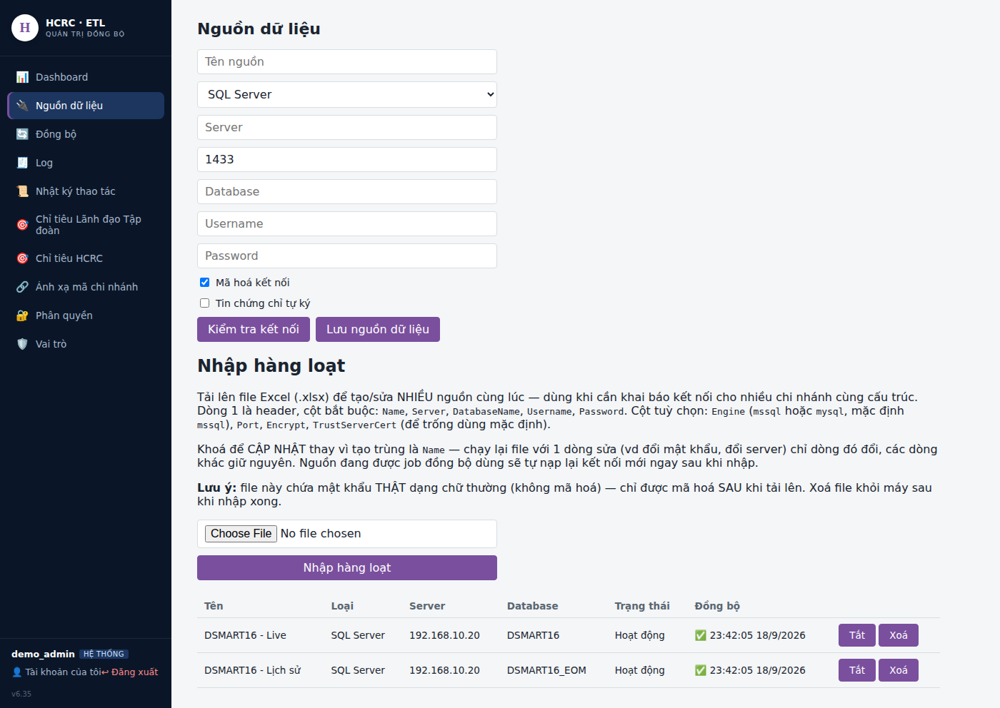

### 2.2 — Tạo 4 job đồng bộ

Vào menu **"Đồng bộ"**. Tạo lần lượt 4 job — form giống hệt nhau, chỉ khác
**Chọn nguồn dữ liệu**/**Domain**/**Lịch chạy** theo bảng dưới:

| # | Tên job (gợi ý) | Nguồn dữ liệu | Bảng/view chính | Cột khoá | Cột ngày | Domain | Ánh xạ mã chi nhánh | Lịch chạy |
|---|---|---|---|---|---|---|---|---|
| 1 | Doanh thu chi nhánh - Live | DSMART16 - Live | `dbo.V_HCRC_DOANHTHU_CHINHANH` | `STK_ID` | `WORK_DATE` | `doanhthu_chinhanh` | (để trống) | `*/15 * * * *` |
| 2 | Doanh thu chi nhánh - Lịch sử | DSMART16 - Lịch sử | `dbo.V_HCRC_DOANHTHU_CHINHANH` | `STK_ID` | `WORK_DATE` | `doanhthu_chinhanh` | (để trống) | `0 3 * * *` |
| 3 | Giao dịch chi nhánh - Live | DSMART16 - Live | `dbo.V_HCRC_GIAODICH_CHINHANH` | `BU_ID` | `TRAN_DATE` | `giaodich_chinhanh` | `BU_ID` | `*/15 * * * *` |
| 4 | Giao dịch chi nhánh - Lịch sử | DSMART16 - Lịch sử | `dbo.V_HCRC_GIAODICH_CHINHANH` | `BU_ID` | `TRAN_DATE` | `giaodich_chinhanh` | `BU_ID` | `0 3 * * *` |

Cả 4 job đều: **Cột thời gian cập nhật (watermark)** = giống Cột ngày;
job 1-2 tick Dimensions `dienTich`/`chain` + Measures `doanhThu`/`laiGop`;
job 3-4 tick Measures `SoGiaoDich`; **BẬT "Giữ lịch sử theo ngày"** ở CẢ 4
job (bắt buộc, không riêng job Live — thiếu ở job nào thì domain đó mất
dữ liệu ngày cũ của đúng nguồn đó); KHÔNG tick "Thêm bảng/view liên kết"
(VIEW đã tự JOIN sẵn).

**Vì sao lịch chạy job Lịch sử thưa hơn (`0 3 * * *` = 3h sáng/ngày thay vì
15 phút/lần)**: CSDL `DSMART16_EOM` là kho lưu trữ tháng ĐÃ ĐÓNG SỔ, không
phát sinh giao dịch mới trong ngày — chạy dày như job Live chỉ tốn tải CSDL
vô ích. Job Live vẫn cần chạy dày vì dữ liệu HÔM NAY đang phát sinh liên
tục.

**Vì sao domain của job 1 và job 2 phải TRÙNG NHAU (`doanhthu_chinhanh`)**
— đây là điểm khác với lý do tách domain doanh thu/giao dịch: 2 job cùng
đọc CÙNG 1 VIEW (`V_HCRC_DOANHTHU_CHINHANH`), CÙNG khoá `STK_ID` — không hề
xung đột ghi đè như trường hợp doanh thu-vs-giao dịch (khác bảng/khác
khoá). Mỗi `Nguồn dữ liệu` tự có 1 `SourceSystem` riêng (etl tự sinh, không
phải gõ tay), nên khoá ghi thật sự vào Data Warehouse là
`(SourceSystem, Domain, EntityCode, EventDate)` — 2 job Live/Lịch sử khác
nhau ở `SourceSystem` (2 nguồn khác nhau) và khác nhau ở `EventDate` (Live
= ngày hiện tại, Lịch sử = ngày quá khứ), nên KHÔNG BAO GIỜ trùng khoá,
KHÔNG ghi đè nhau — dữ liệu 2 nguồn tự nhiên xếp cạnh nhau thành 1 dải
liên tục theo thời gian.

Điền xong cả 4 job (job 1 minh hoạ, các job sau đổi đúng bảng trên):

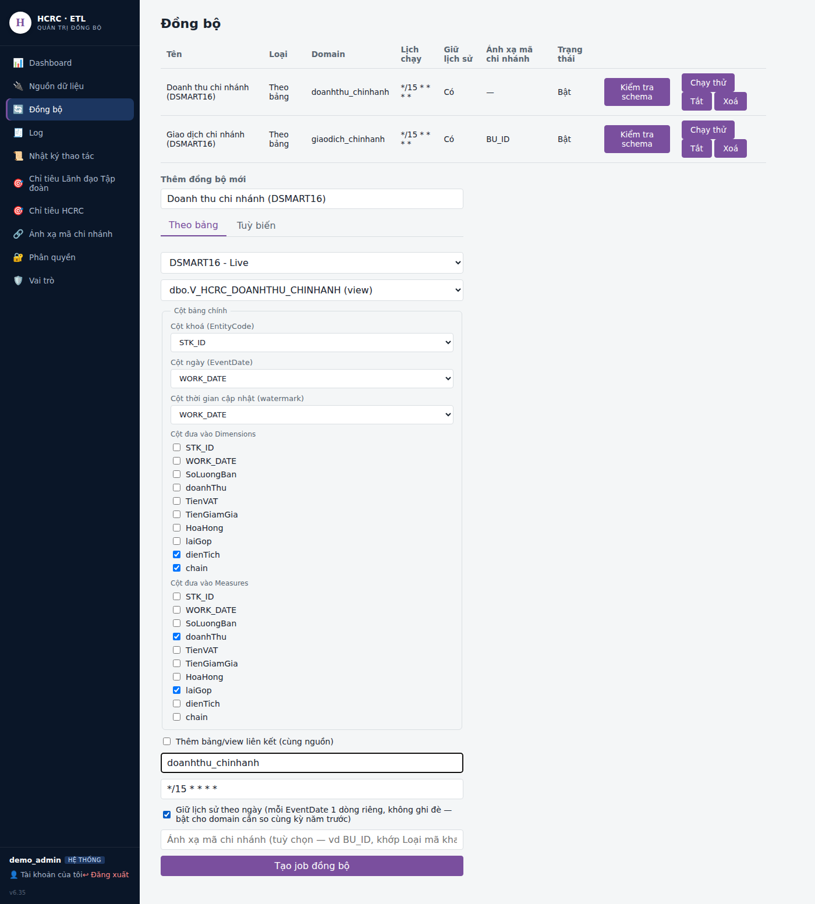

Sau khi tạo đủ 4 job, trang "Đồng bộ" hiện như sau — 2 job đầu cùng domain
`doanhthu_chinhanh`, 2 job sau cùng domain `giaodich_chinhanh`:

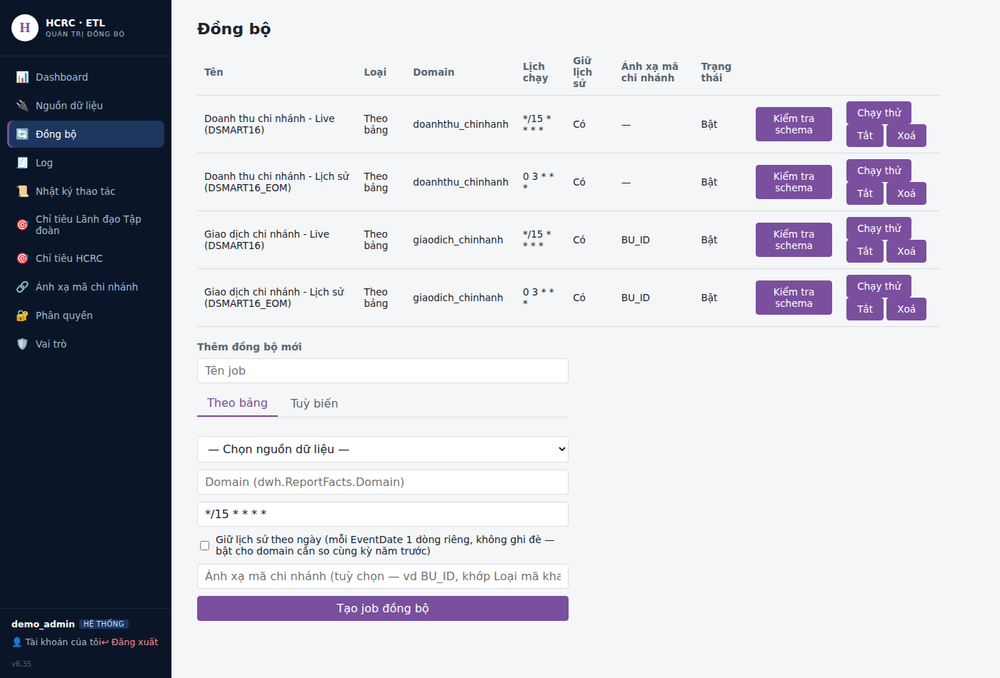

**Riêng Ánh xạ mã chi nhánh (`BU_ID`)** — job 3 VÀ job 4 đều cần bật, vì cả
2 đều đọc từ `TRANSHDR` (khoá gốc `BU_ID`, chưa phải mã chuẩn). Khai sẵn
bảng quy đổi ở menu **"Ánh xạ mã chi nhánh"** (mỗi dòng: `BU_ID` nào ứng
với mã siêu thị chuẩn nào) TRƯỚC khi 2 job này chạy thật — chưa khai đủ
vẫn chạy được, chỉ ghi cảnh báo ở Log cho những mã chưa khai (xem
`etl/README.md`).

---

## Bước 3 — etl-admin: nhập chỉ tiêu tháng

### Chỉ tiêu Lãnh đạo Tập đoàn

Vào menu **"Chỉ tiêu Lãnh đạo Tập đoàn"** (sidebar). Trang KHÔNG có ô nhập
Domain — đã khoá cứng sẵn `sales-targets-ldtd`, không lo trùng với bên kia:

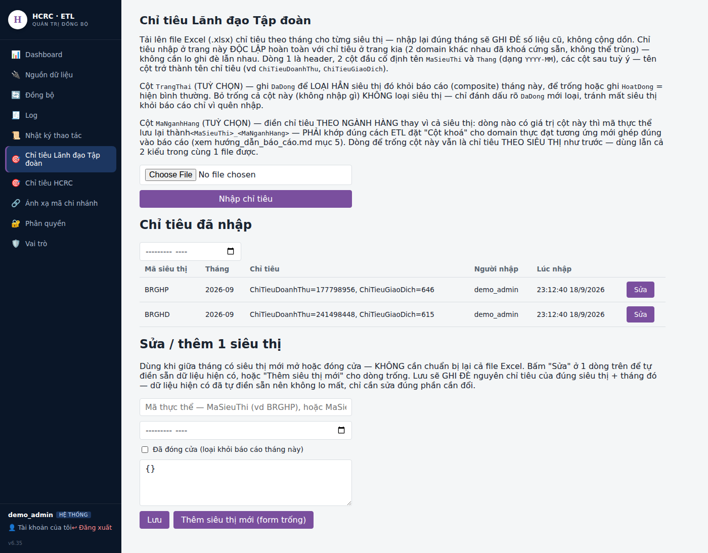

1. Chuẩn bị file Excel (.xlsx), dòng 1 là header, cột `MaSieuThi` +
   `Thang` (dạng `YYYY-MM`) cố định, các cột sau tuỳ ý đặt tên — vd:

   | MaSieuThi | Thang | ChiTieuDoanhThu | ChiTieuGiaoDich |
   |---|---|---|---|
   | BRGHP | 2026-09 | 177798956 | 646 |
   | BRGHD | 2026-09 | 241498448 | 615 |

2. Bấm **"Choose File"**, chọn file → bấm **"Nhập chỉ tiêu"**.
3. Bảng "Chỉ tiêu đã nhập" cập nhật ngay — mỗi dòng có nút "Sửa" để chỉnh
   riêng 1 siêu thị (mở/đóng cửa giữa tháng) mà không cần chuẩn bị lại cả
   file.

### Chỉ tiêu HCRC

Vào menu **"Chỉ tiêu HCRC"**, làm y hệt (file Excel riêng, domain khoá
cứng `sales-targets-hcrc` — độc lập hoàn toàn với trang trên):

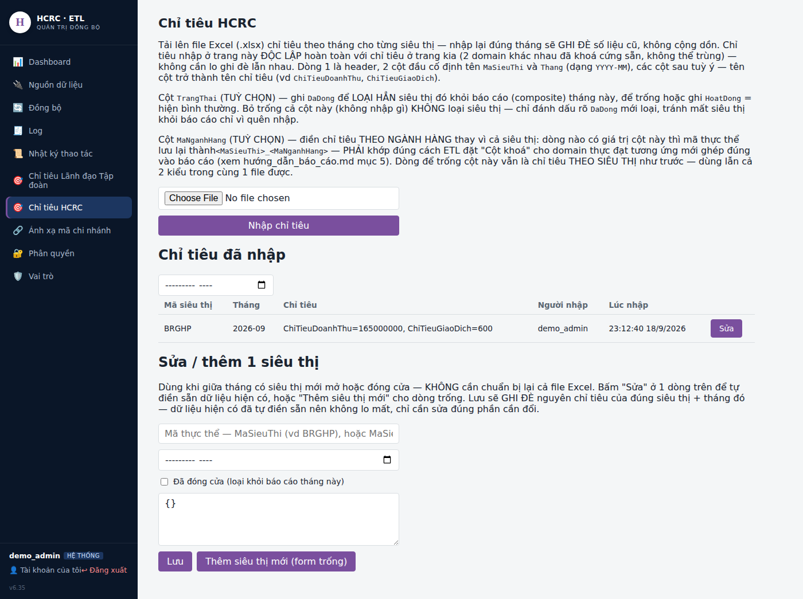

---

## Bước 4 — rp-user: tạo báo cáo

Vào rp-user, menu **"Hệ thống → Biểu mẫu"**, tab **"Báo cáo"** (mặc định).

**Tên field cần đối chiếu lại theo đúng tên bạn đặt khi tạo Sync Job/nhập
chỉ tiêu** (`dienTich`, `doanhThu`, `laiGop`, `SoGiaoDich`,
`ChiTieuDoanhThu`, `ChiTieuGiaoDich`) — JSON dưới đây khớp đúng tên đã dùng
xuyên suốt file này (Bước 2/3), không cần sửa nếu bạn làm đúng theo trên.

### Báo cáo Lãnh đạo Tập đoàn

Điền form:

- **Mã báo cáo**: `bc-doanh-thu-ldtd`
- **Tiêu đề**: `Báo cáo nhanh doanh thu - Lãnh đạo Tập đoàn`
- **Domain**: `doanhthu_chinhanh`
- **Trang báo cáo**: chọn 1 trang (vd "Báo cáo kinh doanh")
- **SourceType**: chọn **"Ghép nhiều nguồn (composite)"**
- **DefinitionJson**: dán nguyên khối sau:

```json
{
  "title": "Báo cáo nhanh doanh thu - Lãnh đạo Tập đoàn",
  "domain": "doanhthu_chinhanh",
  "filters": [
    { "field": "eventDate", "type": "date", "label": "Ngày báo cáo" }
  ],
  "blocks": [
    { "key": "current", "sourceType": "directDb", "domain": "doanhthu_chinhanh" },
    { "key": "currentGD", "sourceType": "directDb", "domain": "giaodich_chinhanh" },
    { "key": "lastYear", "sourceType": "directDb", "domain": "doanhthu_chinhanh", "dateOffsetYears": -1 },
    { "key": "lastYearGD", "sourceType": "directDb", "domain": "giaodich_chinhanh", "dateOffsetYears": -1 },
    { "key": "target", "isTarget": true, "targetDomain": "sales-targets-ldtd" }
  ],
  "columns": [
    { "key": "tenCuaHang", "label": "Siêu thị/Cửa hàng", "formula": "entityCode" },
    { "key": "dienTich", "label": "Diện tích", "formula": "current.dimensions.dienTich" },

    { "key": "dt_chiTieu", "label": "Doanh thu - Chỉ tiêu", "formula": "target.ChiTieuDoanhThu" },
    { "key": "dt_thucDat", "label": "Doanh thu - Thực đạt", "formula": "current.measures.doanhThu" },
    { "key": "dt_tyLeDat", "label": "Doanh thu - Tỉ lệ đạt (%)", "formula": "ROUND(current.measures.doanhThu / target.ChiTieuDoanhThu * 100, 1)" },
    { "key": "dt_cungKy", "label": "Doanh thu - Cùng kỳ năm 2025", "formula": "lastYear.measures.doanhThu" },
    { "key": "dt_lfl", "label": "Doanh thu - Tỷ lệ % LFL", "formula": "ROUND(current.measures.doanhThu / lastYear.measures.doanhThu * 100, 1)" },

    { "key": "lg_tyLe", "label": "Lãi gộp - Tỷ lệ (%)", "formula": "ROUND(current.measures.laiGop / current.measures.doanhThu * 100, 1)" },
    { "key": "lg_giaTri", "label": "Lãi gộp - Giá trị", "formula": "current.measures.laiGop" },

    { "key": "gd_chiTieu", "label": "Giao dịch - Chỉ tiêu", "formula": "target.ChiTieuGiaoDich" },
    { "key": "gd_thucDat", "label": "Giao dịch - Thực đạt", "formula": "currentGD.measures.SoGiaoDich" },
    { "key": "gd_tyLeDat", "label": "Giao dịch - Tỷ lệ đạt (%)", "formula": "ROUND(currentGD.measures.SoGiaoDich / target.ChiTieuGiaoDich * 100, 1)" },
    { "key": "gd_cungKy", "label": "Giao dịch - Cùng kỳ năm 2025", "formula": "lastYearGD.measures.SoGiaoDich" },
    { "key": "gd_lfl", "label": "Giao dịch - Tỷ lệ % LFL", "formula": "ROUND(currentGD.measures.SoGiaoDich / lastYearGD.measures.SoGiaoDich * 100, 1)" },

    { "key": "trungBinhGD", "label": "Trung bình GD", "formula": "ROUND(current.measures.doanhThu / currentGD.measures.SoGiaoDich, 0)" },
    { "key": "doanhThuTrenM2", "label": "Doanh thu/m2", "formula": "ROUND(current.measures.doanhThu / current.dimensions.dienTich, 0)" }
  ],
  "groupBy": {
    "field": "current.dimensions.chain",
    "groups": [
      { "value": "MART", "label": "Tổng cộng MART" },
      { "value": "MINIMART", "label": "Tổng cộng MINIMART" }
    ],
    "grandTotalLabel": "Tổng cộng",
    "labelColumn": "tenCuaHang"
  }
}
```

Form lúc đang dán JSON (khung cuộn xuống thấy phần cuối, khối `target`):

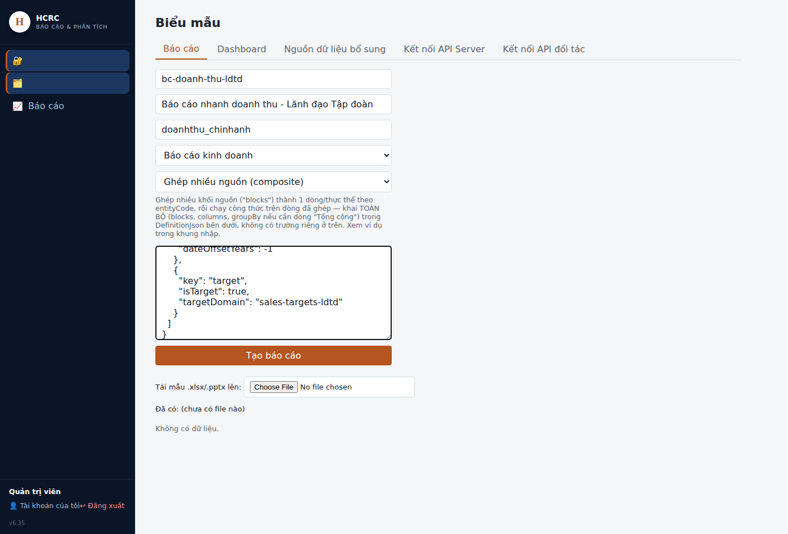

Bấm **"Tạo báo cáo"**. Danh sách bên dưới cập nhật ngay:

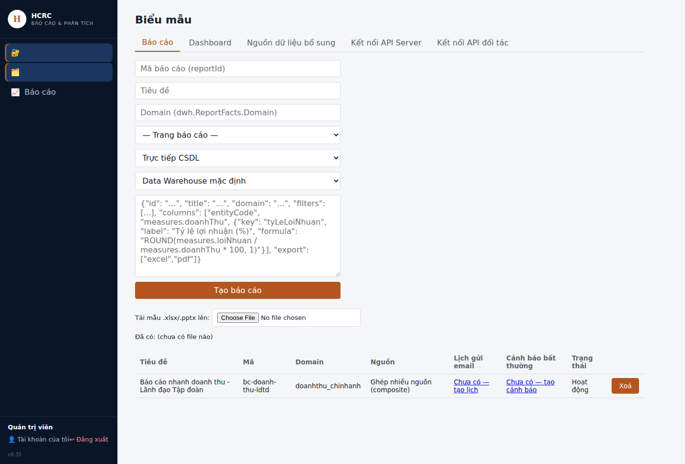

### Báo cáo HCRC

Lặp lại y hệt, đổi:

- **Mã báo cáo**: `bc-doanh-thu-hcrc`
- **Tiêu đề**: `Báo cáo nhanh doanh thu - HCRC`
- **DefinitionJson**: HỆT khối trên, chỉ đổi `title` và `targetDomain` của
  khối `target`:

```json
{
  "title": "Báo cáo nhanh doanh thu - HCRC",
  "domain": "doanhthu_chinhanh",
  "filters": [
    { "field": "eventDate", "type": "date", "label": "Ngày báo cáo" }
  ],
  "blocks": [
    { "key": "current", "sourceType": "directDb", "domain": "doanhthu_chinhanh" },
    { "key": "currentGD", "sourceType": "directDb", "domain": "giaodich_chinhanh" },
    { "key": "lastYear", "sourceType": "directDb", "domain": "doanhthu_chinhanh", "dateOffsetYears": -1 },
    { "key": "lastYearGD", "sourceType": "directDb", "domain": "giaodich_chinhanh", "dateOffsetYears": -1 },
    { "key": "target", "isTarget": true, "targetDomain": "sales-targets-hcrc" }
  ],
  "columns": [
    { "key": "tenCuaHang", "label": "Siêu thị/Cửa hàng", "formula": "entityCode" },
    { "key": "dienTich", "label": "Diện tích", "formula": "current.dimensions.dienTich" },

    { "key": "dt_chiTieu", "label": "Doanh thu - Chỉ tiêu", "formula": "target.ChiTieuDoanhThu" },
    { "key": "dt_thucDat", "label": "Doanh thu - Thực đạt", "formula": "current.measures.doanhThu" },
    { "key": "dt_tyLeDat", "label": "Doanh thu - Tỉ lệ đạt (%)", "formula": "ROUND(current.measures.doanhThu / target.ChiTieuDoanhThu * 100, 1)" },
    { "key": "dt_cungKy", "label": "Doanh thu - Cùng kỳ năm 2025", "formula": "lastYear.measures.doanhThu" },
    { "key": "dt_lfl", "label": "Doanh thu - Tỷ lệ % LFL", "formula": "ROUND(current.measures.doanhThu / lastYear.measures.doanhThu * 100, 1)" },

    { "key": "lg_tyLe", "label": "Lãi gộp - Tỷ lệ (%)", "formula": "ROUND(current.measures.laiGop / current.measures.doanhThu * 100, 1)" },
    { "key": "lg_giaTri", "label": "Lãi gộp - Giá trị", "formula": "current.measures.laiGop" },

    { "key": "gd_chiTieu", "label": "Giao dịch - Chỉ tiêu", "formula": "target.ChiTieuGiaoDich" },
    { "key": "gd_thucDat", "label": "Giao dịch - Thực đạt", "formula": "currentGD.measures.SoGiaoDich" },
    { "key": "gd_tyLeDat", "label": "Giao dịch - Tỷ lệ đạt (%)", "formula": "ROUND(currentGD.measures.SoGiaoDich / target.ChiTieuGiaoDich * 100, 1)" },
    { "key": "gd_cungKy", "label": "Giao dịch - Cùng kỳ năm 2025", "formula": "lastYearGD.measures.SoGiaoDich" },
    { "key": "gd_lfl", "label": "Giao dịch - Tỷ lệ % LFL", "formula": "ROUND(currentGD.measures.SoGiaoDich / lastYearGD.measures.SoGiaoDich * 100, 1)" },

    { "key": "trungBinhGD", "label": "Trung bình GD", "formula": "ROUND(current.measures.doanhThu / currentGD.measures.SoGiaoDich, 0)" },
    { "key": "doanhThuTrenM2", "label": "Doanh thu/m2", "formula": "ROUND(current.measures.doanhThu / current.dimensions.dienTich, 0)" }
  ],
  "groupBy": {
    "field": "current.dimensions.chain",
    "groups": [
      { "value": "MART", "label": "Tổng cộng MART" },
      { "value": "MINIMART", "label": "Tổng cộng MINIMART" }
    ],
    "grandTotalLabel": "Tổng cộng",
    "labelColumn": "tenCuaHang"
  }
}
```

---

## Bước 5 — rp-user: gán quyền xem

Vào **"Hệ thống → Phân quyền"**, bấm tab **"Vai trò"** (mặc định trang mở
ra tab "Người dùng" — nhớ bấm sang tab này):

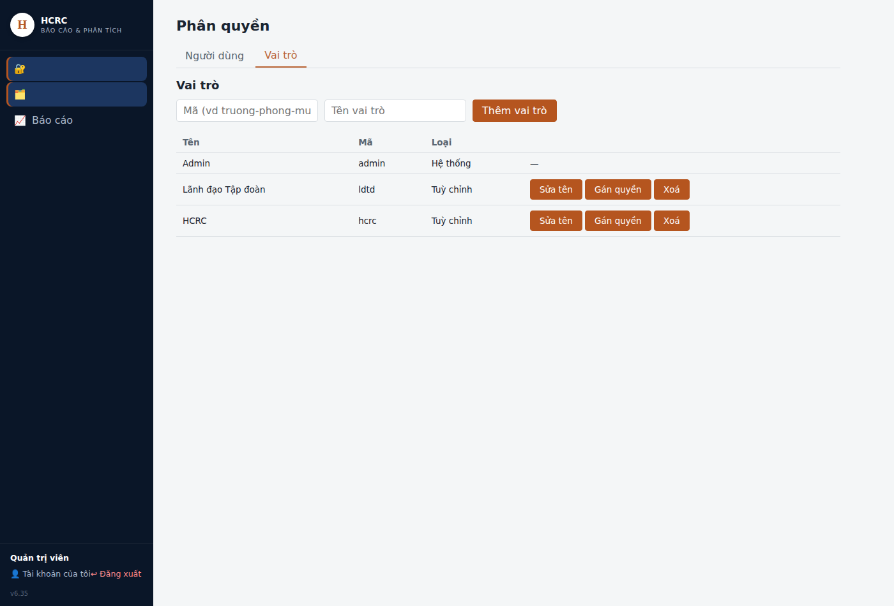

Nếu chưa có 2 vai trò "Lãnh đạo Tập đoàn"/"HCRC", tạo mới bằng form phía
trên (Mã + Tên). Sau đó với từng vai trò, bấm **"Gán quyền"**:

1. **Menu được thấy** — tick trang chứa báo cáo (vd "Báo cáo kinh doanh").
2. **Báo cáo được chạy** — tick ĐÚNG báo cáo của nhóm đó (`Lãnh đạo Tập
   đoàn` tick `bc-doanh-thu-ldtd`, `HCRC` tick `bc-doanh-thu-hcrc` —
   KHÔNG tick chéo).
3. Bấm **"Lưu"**.

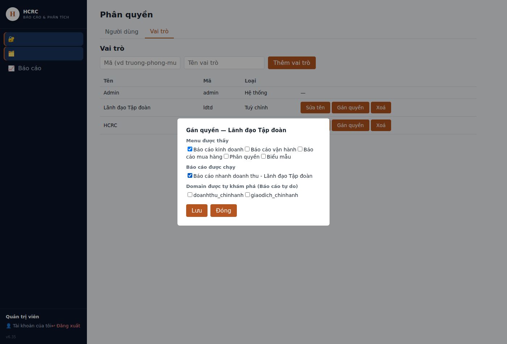

Lặp lại cho vai trò còn lại (chọn đúng báo cáo tương ứng).

---

## Bước 6 — rp-user: đặt lịch gửi email tự động (không bắt buộc, nhưng thường cần cho báo cáo cuối ngày)

Vào **"Hệ thống → Lịch gửi email báo cáo"**. Trang này gửi tự động MỘT báo
cáo cho danh sách người nhận theo lịch — dùng cấu hình SMTP chung đã khai ở
trang "Thiết lập email" (khai 1 lần cho cả hệ thống, không nằm trong phạm
vi file này).

Điền form "Thêm đồng bộ mới" (phần trên trang):

1. **Tên lịch**: đặt tên dễ nhận, vd "Doanh thu ngày - Lãnh đạo Tập đoàn".
2. **Báo cáo**: chọn đúng `bc-doanh-thu-ldtd` vừa tạo ở Bước 4.
3. Tab **"Đơn giản"** (mặc định) → **Tần suất**: "Hàng ngày". **Giờ gửi**:
   mặc định 1 dòng `07:00` — bấm **"+ Thêm giờ gửi"** nếu cần gửi nhiều lần
   trong ngày (vd thêm dòng `17:00` để gửi cả sáng lẫn chiều — mỗi giờ theo
   dõi thành công/lỗi riêng).
4. **Người nhận**: gõ danh sách email, phân tách dấu phẩy (vd
   `bangiamdoc@hcrc.vn, ketoantruong@hcrc.vn`).
5. **Tiêu đề email (Subject)**: gõ `{ngay}` ở chỗ muốn chèn ngày gửi, vd
   `Báo Cáo Nhanh Doanh Thu, Ngày: {ngay}`. Để trống thì dùng mẫu mặc định.
6. **Cách gửi**: giữ **"File đính kèm (Excel/PDF)"** (đơn giản nhất) rồi
   chọn **Định dạng xuất** — Excel hoặc PDF. (Có tuỳ chọn khác "Bảng ngay
   trong nội dung email" kèm tô màu cảnh báo theo ngưỡng — không bắt buộc,
   xem thêm ở `hướng_dẫn_báo_cáo.md` mục 4 nếu cần).
7. Bấm **"Tạo lịch"**.

Form lúc đã điền đủ (2 giờ gửi 09:00 và 17:00):

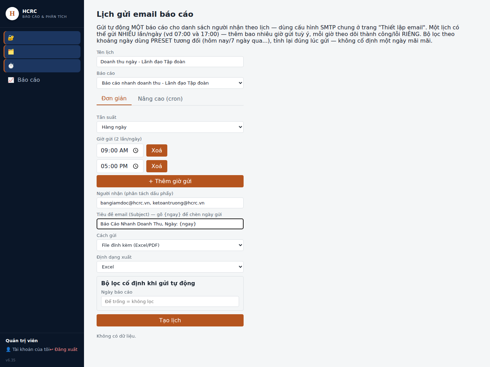

Sau khi tạo, lịch xuất hiện trong bảng bên dưới — bấm **"Gửi ngay"** để thử
gửi ngay lập tức (không cần đợi tới giờ đã đặt), kiểm tra hộp thư người
nhận có tới không:

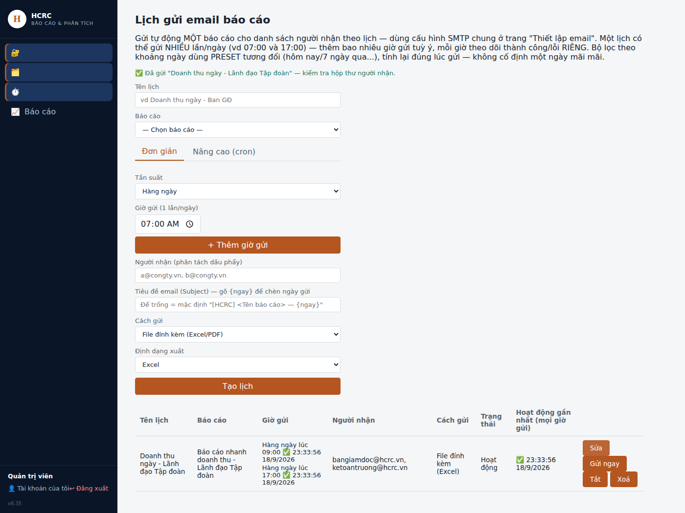

Lặp lại y hệt cho báo cáo HCRC (`bc-doanh-thu-hcrc`) — đặt tên lịch, người
nhận riêng theo đúng nhóm HCRC.

---

## Bước 7 — Kiểm tra

1. **etl-admin → Đồng bộ** — đối chiếu cả **4 job** đã chạy ít nhất 1 lần
   (xem menu "Log"), không báo lỗi — kể cả 2 job "Lịch sử" (chạy lần đầu
   có thể mất thời gian hơn Live vì kéo nguyên lịch sử nhiều tháng/năm).
2. **etl-admin → Log** — nếu job Giao dịch (Live hoặc Lịch sử) báo "còn mã
   BU_ID chưa ánh xạ", bổ sung tiếp vào "Ánh xạ mã chi nhánh".
3. Mở báo cáo LDTD ở rp-user, chọn "Ngày báo cáo" là **hôm nay**, bấm chạy
   — kiểm tra:
   - Đủ số siêu thị đang hoạt động, đúng nhóm MART/MINIMART.
   - Cột "Lãi gộp - Tỷ lệ (%)" KHÔNG phải 100% ở mọi siêu thị (nếu đúng
     100% ở mọi dòng — dấu hiệu `COSTPRICE.MEC_YM` sai định dạng, xem lại
     Bước 1).
   - Cột Giao dịch có số liệu (không trống toàn bộ — nếu trống, kiểm tra
     lại "Ánh xạ mã chi nhánh").
   - **Cột "Cùng kỳ năm 2025" và "Tỷ lệ % LFL" có số liệu** (không trống)
     — đây là cột lấy từ CSDL Lịch sử (`DSMART16_EOM`), nếu trống nghĩa là
     2 job "Lịch sử" (Doanh thu + Giao dịch) chưa chạy được hoặc VIEW ở
     `DSMART16_EOM` chưa tạo đúng — quay lại kiểm tra Bước 1/2.2.
4. Đối chiếu 1 siêu thị bất kỳ: mở lại báo cáo, đổi "Ngày báo cáo" sang
   **đúng ngày này năm ngoái** — số ở cột "Thực đạt" của lần chạy đó phải
   KHỚP với số ở cột "Cùng kỳ năm 2025" khi chạy báo cáo cho ngày hôm nay
   (cùng 1 số liệu, chỉ khác đọc từ domain `directDb` bình thường hay từ
   khối `lastYear`/`dateOffsetYears: -1`) — xác nhận dữ liệu Lịch sử đúng,
   không bị lệch ngày.
5. Sửa thử 1 dòng chỉ tiêu ở trang "Chỉ tiêu Lãnh đạo Tập đoàn", xác nhận
   báo cáo HCRC KHÔNG đổi theo (và ngược lại) — xác nhận đúng 2 domain chỉ
   tiêu độc lập.
6. Ở trang Phân quyền, đăng nhập thử bằng 1 tài khoản chỉ có vai trò "HCRC"
   — xác nhận CHỈ thấy báo cáo `bc-doanh-thu-hcrc`, không thấy báo cáo
   LDTD.

Xong — 2 báo cáo cuối ngày độc lập cho Lãnh đạo Tập đoàn và HCRC đã sẵn
sàng, cùng 1 format cột, chỉ khác nguồn chỉ tiêu.
