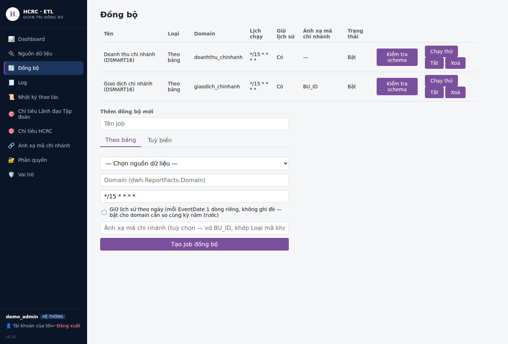

# Hướng dẫn từng bước: tạo báo cáo "Báo cáo nhanh doanh thu" cho Lãnh đạo Tập đoàn (LDTD) và HCRC

File này ĐỘC LẬP, đủ để làm từ đầu đến cuối không cần mở file khác — gồm cả
VIEW SQL, thao tác trên giao diện (kèm ảnh), và nguyên khối `DefinitionJson`
để dán thẳng vào rp-user. Phần giải thích kiến trúc/lý do kỹ thuật sâu hơn
(vì sao 2 domain riêng, các domain DSMART16 khác ngoài 2 báo cáo này...) xem
thêm `hướng_dẫn_báo_cáo.md` mục 11/15 — nhưng không bắt buộc phải đọc để
làm theo file này.

> **Lưu ý về ảnh minh hoạ**: ảnh chụp dưới đây lấy từ ĐÚNG giao diện thật
> của etl-admin/rp-user (không phải hình vẽ tay), nhưng dữ liệu hiển thị
> (tên nguồn, số liệu chỉ tiêu, danh sách báo cáo...) là **dữ liệu mẫu**
> dựng trong môi trường thử nghiệm — không phải dữ liệu thật của DSMART16.
> Bố cục nút bấm/ô nhập là chính xác 100%; tên/số bạn thấy khi làm thật sẽ
> khác (đúng theo dữ liệu bạn có).

---

## Tổng quan các bước

1. Tạo 2 VIEW trên CSDL DSMART16 (làm ở SQL Server Management Studio hoặc
   công cụ quản trị CSDL — KHÔNG phải trên giao diện web).
2. etl-admin → **Đồng bộ**: tạo 2 job đồng bộ trỏ vào 2 VIEW đó.
3. etl-admin → **Chỉ tiêu Lãnh đạo Tập đoàn** / **Chỉ tiêu HCRC**: nhập file
   chỉ tiêu tháng cho từng bên.
4. rp-user → **Hệ thống → Biểu mẫu**: tạo 2 báo cáo (LDTD, HCRC) bằng
   `DefinitionJson`.
5. rp-user → **Hệ thống → Phân quyền**: gán quyền xem đúng báo cáo cho đúng
   nhóm.
6. Kiểm tra lại.

---

## Bước 1 — Tạo VIEW trên CSDL DSMART16 (làm trước, ngoài giao diện web)

Mở SQL Server Management Studio (hoặc công cụ tương đương), kết nối tới
CSDL DSMART16, chạy 2 câu lệnh sau (đã có sẵn, chỉ cần điền đúng 2 mã
`STYPE_ID` thật của MART/MINIMART — xem chú thích ngay dưới):

```sql
-- VIEW 1: Doanh thu + Lãi gộp + Diện tích + Nhóm chuỗi, gộp theo (chi nhánh, ngày)
CREATE VIEW V_HCRC_DOANHTHU_CHINHANH AS
SELECT
    d.STK_ID, d.WORK_DATE,
    SUM(d.TOCUST_QTY) AS SoLuongBan,
    SUM(d.TOCUST_AMT) AS doanhThu,
    SUM(d.TOCUST_VAT) AS TienVAT,
    SUM(d.TOCUST_DIS) AS TienGiamGia,
    SUM(d.TOCUST_COM) AS HoaHong,
    SUM(d.TOCUST_AMT) - SUM(d.TOCUST_QTY * ISNULL(c.COSTPRICE, 0)) AS laiGop,
    MAX(s.DIMENSION) AS dienTich,
    MAX(CASE WHEN s.STYPE_ID = '<mã MART thật>' THEN 'MART'
             WHEN s.STYPE_ID = '<mã MINIMART thật>' THEN 'MINIMART'
             ELSE s.STYPE_ID END) AS chain
FROM DSTK_INFO d
JOIN STOCK s
    ON s.STK_ID = d.STK_ID
LEFT JOIN COSTPRICE c
    ON c.STK_ID = d.STK_ID AND c.SKU_ID = d.SKU_ID
   AND c.MEC_YM = LEFT(CONVERT(char(8), d.WORK_DATE, 112), 6)
GROUP BY d.STK_ID, d.WORK_DATE;
GO

-- VIEW 2: Số giao dịch, gộp theo (chi nhánh, ngày) — BU_ID chưa phải mã chuẩn,
-- sẽ quy đổi ở Bước 2 bằng "Ánh xạ mã chi nhánh"
CREATE VIEW V_HCRC_GIAODICH_CHINHANH AS
SELECT BU_ID, CAST(TRAN_DATE AS DATE) AS TRAN_DATE,
       COUNT(*) AS SoGiaoDich, SUM(AMOUNT) AS TongTien,
       SUM(DISCOUNT) AS TongGiamGia, SUM(VAT_AMT) AS TongVAT
FROM TRANSHDR
WHERE STATUS <> 'X' -- đối chiếu đúng mã STATUS "đã huỷ" thật với DBA DSMART16
GROUP BY BU_ID, CAST(TRAN_DATE AS DATE);
GO
```

**Trước khi chạy thật, cần xác nhận 2 điều với DBA DSMART16** (chưa xác
nhận được từ file schema, chỉ là dự đoán hợp lý theo tên cột):

1. `STOCK.STYPE_ID` — cột phân loại MART/MINIMART. Chạy thử
   `SELECT DISTINCT STYPE_ID FROM STOCK` để biết 2 mã thật, điền vào chỗ
   `'<mã MART thật>'`/`'<mã MINIMART thật>'` ở trên.
2. `COSTPRICE.MEC_YM` — định dạng tháng (giả định `YYYYMM`, vd `'202609'`).
   Nếu sai định dạng, cột Lãi gộp sẽ ra sai (coi giá vốn = 0) mà KHÔNG báo
   lỗi gì — xem cách phát hiện ở Bước 6.

---

## Bước 2 — etl-admin: tạo 2 job đồng bộ

Vào etl-admin, menu **"Đồng bộ"** (sidebar bên trái). Trang hiện danh sách
job đã có + form "Thêm đồng bộ mới" ngay dưới:



### Job 1 — Doanh thu chi nhánh

Điền form "Thêm đồng bộ mới":

1. **Tên job**: đặt tên dễ nhận, vd "Doanh thu chi nhánh (DSMART16)".
2. Tab **"Theo bảng"** (mặc định).
3. **Chọn nguồn dữ liệu** — chọn kết nối DSMART16 đã khai ở "Nguồn dữ liệu"
   (nếu chưa có, vào menu "Nguồn dữ liệu" tạo trước — điền Server/Database/
   Username/Password của DSMART16, tài khoản chỉ đọc).
4. **Chọn bảng/view chính** — chọn `dbo.V_HCRC_DOANHTHU_CHINHANH` (VIEW vừa
   tạo ở Bước 1 — hệ thống tự duyệt danh sách bảng/view thật của nguồn,
   không gõ tay).
5. Sau khi chọn VIEW, hệ thống hiện đủ cột thật — điền:
   - **Cột khoá (EntityCode)**: `STK_ID`
   - **Cột ngày (EventDate)**: `WORK_DATE`
   - **Cột thời gian cập nhật (watermark)**: `WORK_DATE`
   - **Cột đưa vào Dimensions**: tick `dienTich`, `chain`
   - **Cột đưa vào Measures**: tick `doanhThu`, `laiGop` (tick thêm
     `SoLuongBan`/`TienVAT`/`TienGiamGia`/`HoaHong` nếu muốn dùng cho báo
     cáo khác sau này — không bắt buộc cho 2 báo cáo này)
6. **KHÔNG tick "Thêm bảng/view liên kết"** — VIEW đã tự JOIN sẵn
   `STOCK`/`COSTPRICE`, không cần ETL join thêm.
7. **Domain**: gõ `doanhthu_chinhanh`.
8. **Lịch chạy (cron)**: giữ mặc định `*/15 * * * *` (15 phút/lần) hoặc đổi
   theo nhu cầu.
9. **Tick "Giữ lịch sử theo ngày"** — BẮT BUỘC, nếu không sẽ không có số
   "Cùng kỳ năm trước".
10. **Bỏ trống "Ánh xạ mã chi nhánh"** — `STK_ID` đã là mã chuẩn, không cần
    quy đổi.
11. Bấm **"Tạo job đồng bộ"**.

Form sau khi điền đủ trông như sau:


### Job 2 — Giao dịch chi nhánh

Lặp lại y hệt, đổi các ô sau:

- **Tên job**: "Giao dịch chi nhánh (DSMART16)".
- **Chọn bảng/view chính**: `dbo.V_HCRC_GIAODICH_CHINHANH`.
- **Cột khoá (EntityCode)**: `BU_ID`.
- **Cột ngày (EventDate)**: `TRAN_DATE`.
- **Cột thời gian cập nhật**: `TRAN_DATE`.
- **Cột đưa vào Measures**: tick `SoGiaoDich` (đúng chữ hoa như VIEW đã đặt).
- **Domain**: gõ `giaodich_chinhanh` (KHÁC domain job 1 — BẮT BUỘC 2 domain
  riêng: `dwh.ReportFacts` ghi đè NGUYÊN CỘT số liệu khi trùng khoá
  (SourceSystem, Domain, EntityCode, EventDate); doanh thu (khoá `STK_ID`)
  và giao dịch (khoá `BU_ID`) là 2 job/2 bảng nguồn khác nhau — nếu dùng
  chung 1 domain, job nào chạy sau trong ngày sẽ XOÁ MẤT số liệu job chạy
  trước mà không báo lỗi gì. Báo cáo ở Bước 4 sẽ tự ghép lại 2 domain này
  theo đúng mã siêu thị).
- **Tick "Giữ lịch sử theo ngày"**.
- **Ánh xạ mã chi nhánh**: gõ `BU_ID` — BẮT BUỘC cho job này, để hệ thống tự
  quy đổi `BU_ID` sang đúng mã siêu thị chuẩn (khớp `STK_ID` ở job 1) trước
  khi ghi vào Data Warehouse. Cần khai sẵn bảng quy đổi ở menu **"Ánh xạ mã
  chi nhánh"** (mỗi dòng: `BU_ID` nào ứng với mã siêu thị nào) TRƯỚC khi
  job này chạy thật — chưa khai đủ vẫn chạy được, chỉ ghi cảnh báo ở Log
  cho những mã chưa khai (xem `etl/README.md`).

Sau khi tạo xong, quay lại trang "Đồng bộ" sẽ thấy đủ 2 job trong bảng
(đúng như ảnh danh sách ở trên, cột "Ánh xạ mã chi nhánh" của job 2 hiện
`BU_ID`).

---

## Bước 3 — etl-admin: nhập chỉ tiêu tháng

### Chỉ tiêu Lãnh đạo Tập đoàn

Vào menu **"Chỉ tiêu Lãnh đạo Tập đoàn"** (sidebar). Trang KHÔNG có ô nhập
Domain — đã khoá cứng sẵn `sales-targets-ldtd`, không lo trùng với bên kia:


1. Chuẩn bị file Excel (.xlsx), dòng 1 là header, cột `MaSieuThi` +
   `Thang` (dạng `YYYY-MM`) cố định, các cột sau tuỳ ý đặt tên — vd:

   | MaSieuThi | Thang | ChiTieuDoanhThu | ChiTieuGiaoDich |
   |---|---|---|---|
   | BRGHP | 2026-09 | 177798956 | 646 |
   | BRGHD | 2026-09 | 241498448 | 615 |

2. Bấm **"Choose File"**, chọn file → bấm **"Nhập chỉ tiêu"**.
3. Bảng "Chỉ tiêu đã nhập" cập nhật ngay — mỗi dòng có nút "Sửa" để chỉnh
   riêng 1 siêu thị (mở/đóng cửa giữa tháng) mà không cần chuẩn bị lại cả
   file.

### Chỉ tiêu HCRC

Vào menu **"Chỉ tiêu HCRC"**, làm y hệt (file Excel riêng, domain khoá
cứng `sales-targets-hcrc` — độc lập hoàn toàn với trang trên):


---

## Bước 4 — rp-user: tạo báo cáo

Vào rp-user, menu **"Hệ thống → Biểu mẫu"**, tab **"Báo cáo"** (mặc định).

**Tên field cần đối chiếu lại theo đúng tên bạn đặt khi tạo Sync Job/nhập
chỉ tiêu** (`dienTich`, `doanhThu`, `laiGop`, `SoGiaoDich`,
`ChiTieuDoanhThu`, `ChiTieuGiaoDich`) — JSON dưới đây khớp đúng tên đã dùng
xuyên suốt file này (Bước 2/3), không cần sửa nếu bạn làm đúng theo trên.

### Báo cáo Lãnh đạo Tập đoàn

Điền form:

- **Mã báo cáo**: `bc-doanh-thu-ldtd`
- **Tiêu đề**: `Báo cáo nhanh doanh thu - Lãnh đạo Tập đoàn`
- **Domain**: `doanhthu_chinhanh`
- **Trang báo cáo**: chọn 1 trang (vd "Báo cáo kinh doanh")
- **SourceType**: chọn **"Ghép nhiều nguồn (composite)"**
- **DefinitionJson**: dán nguyên khối sau:

```json
{
  "title": "Báo cáo nhanh doanh thu - Lãnh đạo Tập đoàn",
  "domain": "doanhthu_chinhanh",
  "filters": [
    { "field": "eventDate", "type": "date", "label": "Ngày báo cáo" }
  ],
  "blocks": [
    { "key": "current", "sourceType": "directDb", "domain": "doanhthu_chinhanh" },
    { "key": "currentGD", "sourceType": "directDb", "domain": "giaodich_chinhanh" },
    { "key": "lastYear", "sourceType": "directDb", "domain": "doanhthu_chinhanh", "dateOffsetYears": -1 },
    { "key": "lastYearGD", "sourceType": "directDb", "domain": "giaodich_chinhanh", "dateOffsetYears": -1 },
    { "key": "target", "isTarget": true, "targetDomain": "sales-targets-ldtd" }
  ],
  "columns": [
    { "key": "tenCuaHang", "label": "Siêu thị/Cửa hàng", "formula": "entityCode" },
    { "key": "dienTich", "label": "Diện tích", "formula": "current.dimensions.dienTich" },

    { "key": "dt_chiTieu", "label": "Doanh thu - Chỉ tiêu", "formula": "target.ChiTieuDoanhThu" },
    { "key": "dt_thucDat", "label": "Doanh thu - Thực đạt", "formula": "current.measures.doanhThu" },
    { "key": "dt_tyLeDat", "label": "Doanh thu - Tỉ lệ đạt (%)", "formula": "ROUND(current.measures.doanhThu / target.ChiTieuDoanhThu * 100, 1)" },
    { "key": "dt_cungKy", "label": "Doanh thu - Cùng kỳ năm 2025", "formula": "lastYear.measures.doanhThu" },
    { "key": "dt_lfl", "label": "Doanh thu - Tỷ lệ % LFL", "formula": "ROUND(current.measures.doanhThu / lastYear.measures.doanhThu * 100, 1)" },

    { "key": "lg_tyLe", "label": "Lãi gộp - Tỷ lệ (%)", "formula": "ROUND(current.measures.laiGop / current.measures.doanhThu * 100, 1)" },
    { "key": "lg_giaTri", "label": "Lãi gộp - Giá trị", "formula": "current.measures.laiGop" },

    { "key": "gd_chiTieu", "label": "Giao dịch - Chỉ tiêu", "formula": "target.ChiTieuGiaoDich" },
    { "key": "gd_thucDat", "label": "Giao dịch - Thực đạt", "formula": "currentGD.measures.SoGiaoDich" },
    { "key": "gd_tyLeDat", "label": "Giao dịch - Tỷ lệ đạt (%)", "formula": "ROUND(currentGD.measures.SoGiaoDich / target.ChiTieuGiaoDich * 100, 1)" },
    { "key": "gd_cungKy", "label": "Giao dịch - Cùng kỳ năm 2025", "formula": "lastYearGD.measures.SoGiaoDich" },
    { "key": "gd_lfl", "label": "Giao dịch - Tỷ lệ % LFL", "formula": "ROUND(currentGD.measures.SoGiaoDich / lastYearGD.measures.SoGiaoDich * 100, 1)" },

    { "key": "trungBinhGD", "label": "Trung bình GD", "formula": "ROUND(current.measures.doanhThu / currentGD.measures.SoGiaoDich, 0)" },
    { "key": "doanhThuTrenM2", "label": "Doanh thu/m2", "formula": "ROUND(current.measures.doanhThu / current.dimensions.dienTich, 0)" }
  ],
  "groupBy": {
    "field": "current.dimensions.chain",
    "groups": [
      { "value": "MART", "label": "Tổng cộng MART" },
      { "value": "MINIMART", "label": "Tổng cộng MINIMART" }
    ],
    "grandTotalLabel": "Tổng cộng",
    "labelColumn": "tenCuaHang"
  }
}
```

Form lúc đang dán JSON (khung cuộn xuống thấy phần cuối, khối `target`):


Bấm **"Tạo báo cáo"**. Danh sách bên dưới cập nhật ngay:


### Báo cáo HCRC

Lặp lại y hệt, đổi:

- **Mã báo cáo**: `bc-doanh-thu-hcrc`
- **Tiêu đề**: `Báo cáo nhanh doanh thu - HCRC`
- **DefinitionJson**: HỆT khối trên, chỉ đổi `title` và `targetDomain` của
  khối `target`:

```json
{
  "title": "Báo cáo nhanh doanh thu - HCRC",
  "domain": "doanhthu_chinhanh",
  "filters": [
    { "field": "eventDate", "type": "date", "label": "Ngày báo cáo" }
  ],
  "blocks": [
    { "key": "current", "sourceType": "directDb", "domain": "doanhthu_chinhanh" },
    { "key": "currentGD", "sourceType": "directDb", "domain": "giaodich_chinhanh" },
    { "key": "lastYear", "sourceType": "directDb", "domain": "doanhthu_chinhanh", "dateOffsetYears": -1 },
    { "key": "lastYearGD", "sourceType": "directDb", "domain": "giaodich_chinhanh", "dateOffsetYears": -1 },
    { "key": "target", "isTarget": true, "targetDomain": "sales-targets-hcrc" }
  ],
  "columns": [
    { "key": "tenCuaHang", "label": "Siêu thị/Cửa hàng", "formula": "entityCode" },
    { "key": "dienTich", "label": "Diện tích", "formula": "current.dimensions.dienTich" },

    { "key": "dt_chiTieu", "label": "Doanh thu - Chỉ tiêu", "formula": "target.ChiTieuDoanhThu" },
    { "key": "dt_thucDat", "label": "Doanh thu - Thực đạt", "formula": "current.measures.doanhThu" },
    { "key": "dt_tyLeDat", "label": "Doanh thu - Tỉ lệ đạt (%)", "formula": "ROUND(current.measures.doanhThu / target.ChiTieuDoanhThu * 100, 1)" },
    { "key": "dt_cungKy", "label": "Doanh thu - Cùng kỳ năm 2025", "formula": "lastYear.measures.doanhThu" },
    { "key": "dt_lfl", "label": "Doanh thu - Tỷ lệ % LFL", "formula": "ROUND(current.measures.doanhThu / lastYear.measures.doanhThu * 100, 1)" },

    { "key": "lg_tyLe", "label": "Lãi gộp - Tỷ lệ (%)", "formula": "ROUND(current.measures.laiGop / current.measures.doanhThu * 100, 1)" },
    { "key": "lg_giaTri", "label": "Lãi gộp - Giá trị", "formula": "current.measures.laiGop" },

    { "key": "gd_chiTieu", "label": "Giao dịch - Chỉ tiêu", "formula": "target.ChiTieuGiaoDich" },
    { "key": "gd_thucDat", "label": "Giao dịch - Thực đạt", "formula": "currentGD.measures.SoGiaoDich" },
    { "key": "gd_tyLeDat", "label": "Giao dịch - Tỷ lệ đạt (%)", "formula": "ROUND(currentGD.measures.SoGiaoDich / target.ChiTieuGiaoDich * 100, 1)" },
    { "key": "gd_cungKy", "label": "Giao dịch - Cùng kỳ năm 2025", "formula": "lastYearGD.measures.SoGiaoDich" },
    { "key": "gd_lfl", "label": "Giao dịch - Tỷ lệ % LFL", "formula": "ROUND(currentGD.measures.SoGiaoDich / lastYearGD.measures.SoGiaoDich * 100, 1)" },

    { "key": "trungBinhGD", "label": "Trung bình GD", "formula": "ROUND(current.measures.doanhThu / currentGD.measures.SoGiaoDich, 0)" },
    { "key": "doanhThuTrenM2", "label": "Doanh thu/m2", "formula": "ROUND(current.measures.doanhThu / current.dimensions.dienTich, 0)" }
  ],
  "groupBy": {
    "field": "current.dimensions.chain",
    "groups": [
      { "value": "MART", "label": "Tổng cộng MART" },
      { "value": "MINIMART", "label": "Tổng cộng MINIMART" }
    ],
    "grandTotalLabel": "Tổng cộng",
    "labelColumn": "tenCuaHang"
  }
}
```

---

## Bước 5 — rp-user: gán quyền xem

Vào **"Hệ thống → Phân quyền"**, bấm tab **"Vai trò"** (mặc định trang mở
ra tab "Người dùng" — nhớ bấm sang tab này):


Nếu chưa có 2 vai trò "Lãnh đạo Tập đoàn"/"HCRC", tạo mới bằng form phía
trên (Mã + Tên). Sau đó với từng vai trò, bấm **"Gán quyền"**:

1. **Menu được thấy** — tick trang chứa báo cáo (vd "Báo cáo kinh doanh").
2. **Báo cáo được chạy** — tick ĐÚNG báo cáo của nhóm đó (`Lãnh đạo Tập
   đoàn` tick `bc-doanh-thu-ldtd`, `HCRC` tick `bc-doanh-thu-hcrc` —
   KHÔNG tick chéo).
3. Bấm **"Lưu"**.


Lặp lại cho vai trò còn lại (chọn đúng báo cáo tương ứng).

---

## Bước 6 — Kiểm tra

1. **etl-admin → Đồng bộ** — đối chiếu cả 2 job đã chạy ít nhất 1 lần
   (xem menu "Log"), không báo lỗi.
2. **etl-admin → Log** — nếu job Giao dịch báo "còn mã BU_ID chưa ánh xạ",
   bổ sung tiếp vào "Ánh xạ mã chi nhánh".
3. Mở báo cáo LDTD ở rp-user, chọn "Ngày báo cáo", bấm chạy — kiểm tra:
   - Đủ số siêu thị đang hoạt động, đúng nhóm MART/MINIMART.
   - Cột "Lãi gộp - Tỷ lệ (%)" KHÔNG phải 100% ở mọi siêu thị (nếu đúng
     100% ở mọi dòng — dấu hiệu `COSTPRICE.MEC_YM` sai định dạng, xem lại
     Bước 1).
   - Cột Giao dịch có số liệu (không trống toàn bộ — nếu trống, kiểm tra
     lại "Ánh xạ mã chi nhánh").
4. Sửa thử 1 dòng chỉ tiêu ở trang "Chỉ tiêu Lãnh đạo Tập đoàn", xác nhận
   báo cáo HCRC KHÔNG đổi theo (và ngược lại) — xác nhận đúng 2 domain chỉ
   tiêu độc lập.
5. Ở trang Phân quyền, đăng nhập thử bằng 1 tài khoản chỉ có vai trò "HCRC"
   — xác nhận CHỈ thấy báo cáo `bc-doanh-thu-hcrc`, không thấy báo cáo
   LDTD.

Xong — 2 báo cáo cuối ngày độc lập cho Lãnh đạo Tập đoàn và HCRC đã sẵn
sàng, cùng 1 format cột, chỉ khác nguồn chỉ tiêu.
