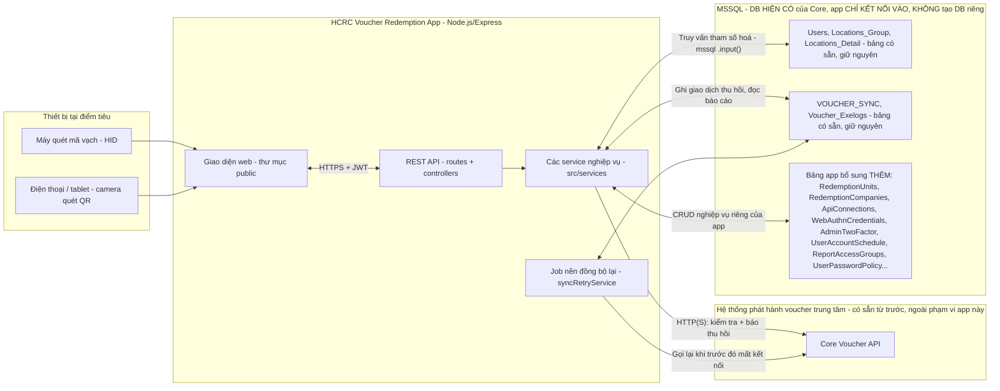
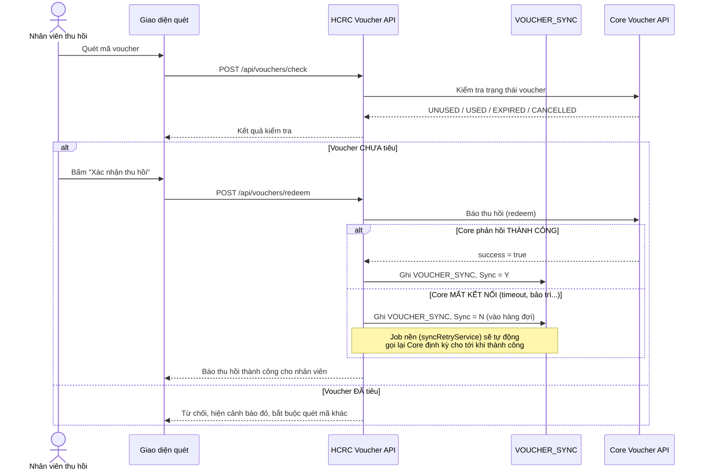

# Hướng dẫn nghiệp vụ — HCRC Voucher Redemption App

Tài liệu này mô tả **nghiệp vụ, cách cấu hình và cách vận hành hàng ngày**
của ứng dụng thu hồi (redeem) voucher tại quầy cho các đơn vị đối tác của
HCRC. Nếu bạn cần **triển khai/cài đặt trên máy chủ**, xem file riêng
`Hướng dẫn triển khai.md` (cùng thư mục) — file này chỉ nói về nghiệp vụ,
cấu hình API, và cấu hình báo cáo.

**Ghi chú cập nhật**: mọi thay đổi/tính năng nghiệp vụ mới nên bổ sung vào
CHÍNH file này; thay đổi liên quan hạ tầng/cài đặt máy chủ bổ sung vào
`Hướng dẫn triển khai.md`.

## Mục lục

1. [Tổng quan & nguyên tắc cốt lõi](#1-tổng-quan--nguyên-tắc-cốt-lõi)
2. [Kiến trúc & luồng dữ liệu](#2-kiến-trúc--luồng-dữ-liệu)
3. [Luồng nghiệp vụ: quét → kiểm tra → thu hồi](#3-luồng-nghiệp-vụ-quét--kiểm-tra--thu-hồi)
4. [Mô hình dữ liệu](#4-mô-hình-dữ-liệu)
5. [Cấu hình kết nối Core Voucher API (qua giao diện Admin)](#5-cấu-hình-kết-nối-core-voucher-api-qua-giao-diện-admin)
6. [Giao diện web — chức năng từng màn hình](#6-giao-diện-web--chức-năng-từng-màn-hình)
7. [Công ty, điểm tiêu & báo cáo tổng hợp](#7-công-ty-điểm-tiêu--báo-cáo-tổng-hợp)
8. [Phân quyền xem báo cáo theo công ty](#8-phân-quyền-xem-báo-cáo-theo-công-ty)
9. [Tài khoản: đăng nhập, 2FA, vân tay/Face ID, thời hạn](#9-tài-khoản-đăng-nhập-2fa-vân-tayface-id-thời-hạn)
10. [Hàng đợi đồng bộ khi Core API mất kết nối](#10-hàng-đợi-đồng-bộ-khi-core-api-mất-kết-nối)
11. [Tham chiếu API](#11-tham-chiếu-api)
12. [Câu hỏi thường gặp](#câu-hỏi-thường-gặp)

---

## 1. Tổng quan & nguyên tắc cốt lõi

Ứng dụng web (KHÔNG phải POS) cấp cho **các đơn vị đối tác** để **quét và
thu hồi (redeem) voucher tại quầy**, đối chiếu ngay lập tức với hệ thống
phát hành trung tâm (**Core Voucher API**), rồi **báo cáo lại theo từng
công ty/điểm tiêu** cho HCRC quản lý.

**Nguyên tắc quan trọng nhất**: DB nghiệp vụ (`Users`, `Locations_Group`,
`Locations_Detail`, `VOUCHER_SYNC`, `Voucher_Exelogs`) là DB **HIỆN CÓ**
của hệ thống Core — app này **KHÔNG tạo DB riêng**, chỉ **KẾT NỐI VÀO** và
**KẾ THỪA** toàn bộ dữ liệu/tài khoản đang có sẵn. App chỉ bổ sung THÊM
các bảng mới cho nghiệp vụ của riêng nó (mục 4), tuyệt đối không sửa cấu
trúc hay xoá dữ liệu trên các bảng cũ.

Stack: **Node.js (Express) + MSSQL** (kết nối vào DB hiện có, không tạo
DB mới).

## 2. Kiến trúc & luồng dữ liệu



**Đọc sơ đồ**: app **không bao giờ thay thế** Core Voucher API — Core vẫn
là **nguồn sự thật duy nhất** về trạng thái "đã tiêu/chưa tiêu" của
voucher. App chỉ đóng vai trò **giao diện thu hồi tại quầy + lớp báo cáo
theo công ty/điểm tiêu** riêng cho HCRC, và **dùng chung** khối DB nghiệp
vụ cốt lõi (`Users`/`Locations_*`/`VOUCHER_SYNC`) với hệ thống Core hiện
có thay vì tách riêng — tránh 2 nơi dữ liệu lệch nhau.

## 3. Luồng nghiệp vụ: quét → kiểm tra → thu hồi

1. Nhân viên tại điểm tiêu **đăng nhập** (tài khoản có sẵn trong `Users`,
   hoặc tài khoản mới được admin tạo/gán thêm — xem mục 9).
2. **Quét mã voucher** bằng máy quét mã vạch HID (cắm vào PC/tablet như
   bàn phím) hoặc camera điện thoại (quét QR) — **không cho gõ tay** để
   tránh đọc/đoán mã.
3. App gọi **Core Voucher API** để **kiểm tra** (`checkVoucher`) — hỏi
   Core "voucher này còn dùng được không". Đây là bước CHỈ ĐỌC, không làm
   thay đổi trạng thái voucher.
4. Nếu Core trả về **CHƯA tiêu**: hiện mệnh giá/hạn dùng/ngày cấp, cho
   phép nhân viên bấm **"Xác nhận thu hồi"** → app gọi tiếp `redeemVoucher`
   để **báo Core** voucher này vừa được tiêu tại điểm này, đồng thời **ghi
   1 dòng vào `VOUCHER_SYNC`** (bảng có sẵn, đúng đúng nghiệp vụ cũ) để
   phục vụ báo cáo/đối soát của riêng HCRC (vì 1 mình Core API không biết
   được giao dịch này thuộc **công ty/điểm tiêu nào** của HCRC — xem mục 7).
5. Nếu Core trả về **ĐÃ tiêu**: cảnh báo đỏ, không cho thu hồi, bắt buộc
   quét mã khác.
6. **Nếu mất kết nối tới Core đúng lúc báo thu hồi** (sau khi vừa xác
   nhận CHƯA tiêu vài giây trước): app **vẫn cho thu hồi thành công tại
   quầy** (không làm gián đoạn khách hàng đang chờ), dựa vào "hàng đợi
   đồng bộ" (`VOUCHER_SYNC.Sync='N'`) và có job nền tự động gửi lại cho
   Core sau — xem mục 10.
7. Admin xem **báo cáo đối soát theo ngày** (mục 6) và **báo cáo tổng hợp
   theo khoảng ngày, cộng dồn theo Công ty → Điểm tiêu** (mục 7) — mỗi tài
   khoản **mặc định chỉ thấy dữ liệu công ty của chính mình**, trừ khi
   được cấp quyền xem chéo/xem toàn bộ (mục 8).
8. Các lớp bảo mật bao quanh toàn bộ luồng trên: khoá tạm khi gõ sai liên
   tục, xác thực hai yếu tố bắt buộc cho quản trị, đăng nhập vân tay/Face
   ID qua PWA, bắt buộc đổi mật khẩu lần đầu, giới hạn thời hạn sử dụng
   tài khoản — tất cả xem mục 9.

### 3a. Luồng quét — thu hồi khi Core mất kết nối



**Nguyên tắc**: app **không tự quản lý** trạng thái "đã tiêu/chưa tiêu" —
đó là trách nhiệm của Core Voucher API (nguồn sự thật duy nhất), tránh 2
hệ thống lệch nhau. Mỗi lần quét, app gọi `checkVoucher()` sang Core API
trước, rồi mới cho phép người dùng bấm "Xác nhận thu hồi" (gọi
`redeemVoucher()`). App có gọi lại `checkVoucher()` một lần nữa ngay
trước khi thực sự redeem (chống trường hợp 2 người quét cùng 1 voucher
gần như đồng thời); việc đảm bảo **không thể tiêu trùng 1 voucher 2 lần**
vẫn phải do Core API xử lý (ví dụ bằng unique constraint/optimistic lock
bên đó), vì đây là nguồn dữ liệu gốc.

## 4. Mô hình dữ liệu

### Đã có sẵn (không thay đổi cấu trúc)

| Bảng | Vai trò trong app mới |
|---|---|
| `Users` | Đăng nhập — **giữ nguyên tài khoản cũ**, app chỉ đọc/so sánh mật khẩu và (khi cần) ghi đè lại `Password` khi đổi mật khẩu (mục 9d). |
| `Locations_Group`, `Locations_Detail` | Danh mục địa điểm — app chỉ **đọc**, không ghi. |
| `VOUCHER_SYNC` | App **ghi thêm dòng mới** mỗi khi thu hồi thành công (giữ nguyên đúng ý gốc: nơi lưu bản ghi đã tiêu để đối soát). |
| `Voucher_Exelogs` | App **ghi thêm dòng mới** mỗi lần job đồng bộ chạy (đúng ý gốc: log hệ thống). |

### Bổ sung (thư mục `sql/` trong mã nguồn)

- `RedemptionUnits`: thông tin nghiệp vụ chi tiết của **đơn vị thu hồi**
  — mã đối tác, tên, người liên hệ, địa chỉ, MST, tài khoản ngân hàng,
  hạn mức/ngày... Liên kết 1-1 với `Locations_Detail` qua
  `LocationDetailId`, không đụng chạm bảng cũ.
- `VoucherScanLogs`: log toàn bộ lượt quét/kiểm tra (cả CHECK và REDEEM),
  phục vụ đối soát và điều tra khi có tranh chấp.
- Các index hỗ trợ trên `VOUCHER_SYNC` để truy vấn báo cáo nhanh hơn.
- `ApiConnections` + `ApiConnectionTestLogs`: lưu cấu hình kết nối Core
  Voucher API do admin tự khai báo qua UI (secret được mã hoá) và log
  lịch sử các lần bấm nút "Test" trên màn hình cấu hình.
- `Voucher_Exelogs` (chỉ tạo nếu **CHƯA** có sẵn — môi trường thật của bạn
  đã có bảng này): dùng lại đúng mục đích gốc để ghi log hệ thống của job
  đồng bộ lại voucher lỗi (mục 10).
- `WebAuthnCredentials`: lưu **khoá công khai** của từng passkey (vân
  tay/Face ID) đã đăng ký cho từng tài khoản — không lưu dữ liệu sinh
  trắc học thật (vân tay/khuôn mặt không bao giờ rời khỏi thiết bị của
  người dùng) — xem mục 9b.
- `AdminTwoFactor`: lưu secret TOTP (**đã mã hoá** AES-256-GCM) của từng
  tài khoản quản trị — **bắt buộc** đối với `Users.status = 1`, không áp
  dụng cho nhân viên thu hồi thường — xem mục 9a.
- `UserAccountSchedule`: mốc `ActiveFrom`/`ActiveUntil` (tuỳ chọn) cho
  **từng tài khoản** — cho phép cấp tài khoản có thời hạn, tự động kích
  hoạt/hết hạn dùng theo 2 mốc này mà không cần job nền — xem mục 9c.
- `RedemptionCompanies` + cột `CompanyId` trên `RedemptionUnits`: thêm cấp
  **"Công ty"** phía trên từng điểm tiêu — 1 công ty có thể gắn **nhiều
  điểm tiêu** (vd chuỗi nhiều chi nhánh của cùng 1 đối tác). Thông tin
  liên hệ/thuế/ngân hàng chung của cả công ty nằm ở đây, tách khỏi từng
  điểm — xem mục 7.
- `ReportAccessGroups`, `ReportAccessGroupCompanies`, `UserReportAccess`:
  nhóm quyền xem báo cáo chéo/toàn bộ công ty, gán theo từng tài khoản —
  xem mục 8.
- `UserPasswordPolicy`: đánh dấu tài khoản nào **đã đổi mật khẩu** qua app
  này, dùng để bắt buộc đổi mật khẩu lần đăng nhập đầu tiên — xem mục 9d.
- `WebAuthnChallenges`: lưu TẠM challenge đăng ký/đăng nhập vân tay-Face
  ID trong DB thay vì bộ nhớ — để dùng được khi chạy nhiều worker
  (`CLUSTER_WORKERS > 1`) — xem mục 9b.

## 5. Cấu hình kết nối Core Voucher API (qua giao diện Admin)

Thay vì sửa code, admin có thể tự cấu hình + test kết nối Core API ngay
trên web tại **menu "Kết nối API"** (`/api-connection.html`, yêu cầu tài
khoản admin — `Users.status = 1`).

Màn hình cho phép khai báo trực quan, không cần biết lập trình:

1. **Base URL + xác thực**: Bearer token / API key theo header riêng /
   Basic Auth. Secret được **mã hoá AES-256-GCM** trước khi lưu vào DB
   (bảng `ApiConnections`), không bao giờ trả về plaintext cho trình
   duyệt sau khi lưu (chỉ hiện "đã lưu, để trống để giữ nguyên").
2. **Endpoint kiểm tra (Check)**: chọn method GET/POST, khai báo mã
   voucher nằm ở đâu (path `{code}` / query string / body JSON), và **ánh
   xạ đường dẫn field** trong response JSON trả về (ví dụ `status`,
   `valueAmt`, `issueDate`...) sang các trường chuẩn của app. Hỗ trợ thêm
   **bảng ánh xạ giá trị trạng thái** (ví dụ Core API trả `"0"` → app hiểu
   là `UNUSED`) vì mỗi hệ thống đặt tên trạng thái khác nhau.
3. **Endpoint thu hồi (Redeem)**: tương tự, cho phép soạn body JSON
   template với các placeholder
   `{code} {username} {locationsGroup} {locationsDetail} {transNum}`.
4. **Test ngay khi cấu hình**: nhập 1 mã voucher thật, bấm **"Test kiểm
   tra"** để gọi thẳng sang Core API bằng đúng cấu hình đang gõ trên form
   (chưa cần bấm Lưu) và xem kết quả chuẩn hoá + response thô ngay lập
   tức — phát hiện lỗi mapping trước khi kích hoạt cho toàn bộ đối tác sử
   dụng. Có riêng nút **"Test thu hồi"** (có cảnh báo + checkbox xác nhận
   bắt buộc) vì thao tác này sẽ **tiêu thật** voucher trên hệ thống Core,
   không thể hoàn tác.
5. Có thể tạo nhiều kết nối (ví dụ Test/Production) nhưng chỉ 1 kết nối
   được **"Kích hoạt"** tại 1 thời điểm — đó là kết nối mà toàn bộ màn
   hình quét voucher đang sử dụng.

Nếu **chưa** cấu hình/kích hoạt kết nối nào trên UI, app sẽ **fallback**
dùng cấu hình tĩnh trong `.env` (`CORE_API_*`, xem `Hướng dẫn triển
khai.md`) với hợp đồng JSON cố định mô tả bên dưới — giúp app vẫn chạy
được trong lúc admin đang thiết lập kết nối qua UI.

### 5a. Hợp đồng fallback qua `.env` (chỉ áp dụng khi chưa có kết nối nào trên UI)

**Kiểm tra voucher** — `GET {CORE_API_BASE_URL}{CORE_API_CHECK_PATH}?voucherCode=ABC123456789`
```json
// response mong đợi (200)
{
  "found": true,
  "status": "UNUSED",              // UNUSED | USED | EXPIRED | CANCELLED
  "serial": "SR-000123",
  "valueAmt": 200000,
  "issueDate": "2026-01-01T00:00:00Z",
  "expiryDate": "2026-12-31T23:59:59Z"
}
```

**Thu hồi (đánh dấu đã tiêu)** — `POST {CORE_API_BASE_URL}{CORE_API_REDEEM_PATH}`
```json
// request
{
  "voucherCode": "ABC123456789",
  "redeemedBy": "username",
  "locationsGroup": "GRP01",
  "locationsDetail": "LOC01",
  "transNum": "260903153000A1B2C3"
}

// response mong đợi (200)
{ "success": true, "status": "REDEEMED", "transRef": "...", "redeemedAt": "2026-09-03T15:30:00Z" }
```

Nếu Core API thật có tên field/cấu trúc khác, chỉ cần sửa 2 hàm
`normalizeCheckResponse()` và `normalizeRedeemResponse()` trong
`src/services/coreVoucherService.js` — phần còn lại của app không cần
đụng vào.

## 6. Giao diện web — chức năng từng màn hình

- `login.html`: đăng nhập.
- `index.html`: màn hình quét chính — 1 ô input nhận dữ liệu từ máy quét
  HID (tự động focus, Enter = kiểm tra) và nút "Quét bằng camera" (dùng
  thư viện `html5-qrcode` qua CDN) cho điện thoại/tablet không có máy
  quét rời.
- `units.html`: **(admin)** quản lý công ty + điểm tiêu voucher (thêm/xem)
  — xem mục 7.
- `report.html`: báo cáo đối soát theo ngày, theo từng địa điểm tài khoản
  đang đăng nhập.
- `summary-report.html`: báo cáo tổng hợp theo khoảng ngày, nhóm Công ty
  → Điểm tiêu, cộng dồn 2 cấp + tổng toàn bộ công ty — tách biệt với
  `report.html` — xem mục 7.
- `used-vouchers.html`: danh sách PHẲNG toàn bộ voucher đã sử dụng (không
  cộng dồn), lọc theo ngày tuỳ chọn, có nút **xuất Excel** — xem mục 7c.
- `api-connection.html`: **(admin)** khai báo/kích hoạt kết nối Core
  Voucher API và test trực tiếp bằng voucher thật ngay khi cấu hình — xem
  mục 5.

Luồng quét trên UI:
1. Quét mã (máy quét HID hoặc camera — **không thể gõ tay**) → gọi
   `/vouchers/check`.
2. Nếu **chưa tiêu**: hiện mệnh giá/hạn dùng/ngày cấp + nút "Xác nhận thu
   hồi".
3. Bấm xác nhận → gọi `/vouchers/redeem` → lưu vào `VOUCHER_SYNC`, hiện
   thông báo thành công (hoặc "đang chờ đồng bộ" nếu Core tạm thời mất
   kết nối — xem mục 10), bảng giao dịch gần đây hiện cột "Đồng bộ" (ĐÃ
   ĐỒNG BỘ / CHỜ ĐỒNG BỘ), tự động focus lại ô quét cho mã tiếp theo.
4. Nếu **đã tiêu**: hiện cảnh báo đỏ, chỉ còn nút "Quét mã khác" — không
   cho thu hồi.

## 7. Công ty, điểm tiêu & báo cáo tổng hợp

Ứng dụng cấp tài khoản cho **nhiều đối tác** sử dụng, mỗi đối tác có thể
có **nhiều điểm tiêu** (vd chuỗi cửa hàng nhiều chi nhánh) — cần báo cáo
được theo từng công ty, theo từng điểm, và tổng hợp toàn bộ. Đây là lý do
có thêm cấp **"Công ty"** phía trên `RedemptionUnits` (vốn trước giờ là
1-1 với 1 địa điểm), và 1 **báo cáo tổng hợp** riêng, **tách biệt** với
"Báo cáo đối soát" (mục 6 — báo cáo đó chỉ xem theo từng ngày, nhóm theo
địa điểm của tài khoản đang đăng nhập).

### 7a. Công ty & điểm tiêu

Màn hình **"Đơn vị thu hồi"** (`/units.html`, chỉ admin) gồm 2 cấp:

1. **Công ty** (`RedemptionCompanies`) — khai báo trước: mã, tên, người
   liên hệ, MST, tài khoản ngân hàng... (thông tin chung cho cả đối tác).
2. **Điểm tiêu** (`RedemptionUnits`, vẫn giữ 1-1 với 1 `Locations_Detail`
   như trước) — bắt buộc chọn **Công ty** khi tạo mới qua cột
   `CompanyId`. **1 công ty có thể gắn nhiều điểm tiêu** — tạo nhiều
   điểm, cùng chọn 1 công ty ở dropdown.

Điểm tiêu **đã khai báo trước khi có khái niệm Công ty** vẫn giữ nguyên
`CompanyId = NULL` (không bị xoá/hỏng dữ liệu) — các giao dịch của những
điểm này sẽ xuất hiện dưới nhóm **"Chưa gắn công ty"** trong báo cáo tổng
hợp cho tới khi được gắn công ty.

### 7b. Báo cáo tổng hợp (`/summary-report.html`)

Chọn 1 **khoảng ngày** (từ - đến, không giới hạn trong 1 ngày như báo cáo
đối soát), xem bảng phân cấp 2 cấp cộng dồn:

```
Công ty A                                                    12 voucher   3.400.000 đ   <- cộng dồn cấp công ty
  Điểm tiêu 1                                                 7 voucher   2.000.000 đ   <- cộng dồn cấp điểm
    12/09  Nguyễn Văn A   TRANS-xxx   VC-0001              -   200.000 đ               <- chi tiết từng giao dịch
    ...
  Điểm tiêu 2                                                 5 voucher   1.400.000 đ
    ...
Công ty B                                                     4 voucher   1.000.000 đ
  ...
TỔNG TOÀN BỘ CÔNG TY                                         16 voucher   4.400.000 đ   <- tổng tất cả công ty
```

Nguồn dữ liệu vẫn là `VOUCHER_SYNC` (dùng bảng với báo cáo đối soát,
không tạo bản ghi song song) — nối với `Locations_Detail` (theo mã) rồi
nối tiếp sang `RedemptionUnits`/`RedemptionCompanies` để biết giao dịch
đó thuộc điểm/công ty nào. Cột "Người tiêu" đọc trực tiếp từ `User_Name`
đã lưu sẵn trong `VOUCHER_SYNC` lúc thu hồi — không cần truy vấn thêm.

### 7c. Danh sách toàn bộ voucher đã sử dụng + xuất Excel (`/used-vouchers.html`)

Khác với "Báo cáo tổng hợp" (7b, cộng dồn theo Công ty → Điểm tiêu), trang
này hiện **1 dòng = 1 giao dịch**, không cộng dồn — dùng khi cần xem/đối
soát chi tiết từng voucher hoặc xuất dữ liệu ra ngoài:

- **Bộ lọc ngày tuỳ chọn** — để trống cả 2 ô "Từ ngày"/"Đến ngày" sẽ lấy
  **TOÀN BỘ lịch sử** (không giới hạn); điền 1 hoặc cả 2 ô để thu hẹp
  phạm vi.
- **Nút "Xuất Excel"** — tải về file `.xlsx` **thật** (dùng thư viện
  `exceljs`, không phải CSV đổi tên) với đúng dữ liệu đang hiển thị trên
  màn hình (cùng bộ lọc ngày, cùng phạm vi công ty được phép xem).
- Nguồn dữ liệu **vẫn là `VOUCHER_SYNC`** — không cần bảng dữ liệu riêng.
- Áp dụng **đúng phân quyền xem theo công ty** như 2 báo cáo còn lại (mục
  8) — 1 tài khoản mặc định chỉ thấy/xuất được voucher của công ty mình,
  trừ khi được cấp quyền xem chéo/toàn bộ.

## 8. Phân quyền xem báo cáo theo công ty

Nhiều tài khoản của nhiều đối tác khác nhau cùng đăng nhập chung 1 ứng
dụng, nên **mặc định** 1 tài khoản **CHỈ được xem doanh thu/báo cáo của
đúng công ty gắn với địa điểm của chính mình** (`Users.Locations_Detail`
→ `RedemptionUnits` → `RedemptionCompanies`) — không thấy dữ liệu của
công ty khác. Áp dụng cho cả **3 báo cáo**: "Báo cáo đối soát" (mục 6),
"Báo cáo tổng hợp" (mục 7b) và "Danh sách voucher đã sử dụng" kể cả lúc
**xuất Excel** (mục 7c).

Admin có thể cấp thêm quyền xem **chéo** hoặc **xem nhiều công ty** bằng
cách tạo **nhóm quyền** và gán tài khoản vào nhóm, tại màn hình **"Đơn vị
thu hồi"** (`/units.html`, khu vực "Nhóm quyền xem báo cáo") và màn hình
**"Tài khoản"** (`/users.html`, cột "Nhóm quyền xem báo cáo"):

- **Mặc định (không gắn nhóm)**: chỉ xem đúng công ty của địa điểm gắn
  với tài khoản.
- **Nhóm phạm vi "ALL"**: xem được **toàn bộ tất cả công ty** (không lọc
  gì cả).
- **Nhóm phạm vi "SPECIFIC"**: xem được công ty của chính mình **cộng
  thêm** danh sách công ty được chỉ định trong nhóm (xem chéo/xem nhiều
  công ty cùng lúc).

API quản trị: `GET/POST/PUT /api/access-groups` (CRUD nhóm quyền, chỉ
admin) và `PUT /api/users/:userId/report-access` (gán/bỏ tài khoản khỏi 1
nhóm, chỉ admin).

## 9. Tài khoản: đăng nhập, 2FA, vân tay/Face ID, thời hạn

### 9a. Xác thực hai yếu tố bắt buộc cho quản trị (2FA)

Tài khoản quản trị (`Users.status = 1`) nắm giữ quyền cấu hình kết nối
Core API và thông tin đối tác, nên **bắt buộc** phải bật xác thực hai yếu
tố (TOTP — Google Authenticator, Microsoft Authenticator, Authy...)
trước khi vào được ứng dụng. Nhân viên thu hồi thường (`status = 0`)
**không** bị ảnh hưởng, đăng nhập bình thường như trước.

**Luồng đăng nhập của tài khoản quản trị**:
1. Đăng nhập bằng mật khẩu (hoặc vân tay/Face ID) như bình thường.
2. Sau khi xác minh danh tính đúng, server **chưa** cấp phiên đầy đủ mà
   trả về 1 token TẠM (hết hạn sau 10 phút):
   - **Lần đầu chưa từng thiết lập 2FA** → chuyển sang `2fa-setup.html`:
     hiện mã QR + mã nhập thủ công, quét bằng ứng dụng xác thực, nhập mã
     6 số hiện ra để xác nhận. Xác nhận đúng sẽ được cấp phiên đầy đủ
     ngay (không cần đăng nhập lại lần nữa).
   - **Đã bật 2FA từ trước** → chuyển sang `2fa-verify.html`: chỉ cần
     nhập mã 6 số đang hiện trên ứng dụng xác thực là vào được, không
     phải quét lại QR.
3. Token TẠM **không dùng được** cho bất kỳ API nghiệp vụ nào khác — dù
   bị lộ cũng không thể gọi quét/thu hồi voucher, chỉ gọi được đúng 2
   nhóm API thiết lập/xác minh 2FA.

**Quản trị viên khác gỡ được 2FA cho nhau** (khôi phục khi mất thiết bị):
màn hình **"Bảo mật"** (`/security.html`, chỉ tài khoản admin) liệt kê
toàn bộ quản trị viên kèm trạng thái 2FA, và cho phép:
- **Đổi thiết bị xác thực**: tự mình (đang có phiên đăng nhập hợp lệ)
  bấm "Đổi thiết bị xác thực" để thiết lập lại TOTP trên thiết bị mới —
  không cần ai giúp.
- **Gỡ 2FA của một admin khác** (khi họ bị mất điện thoại/mất thiết bị
  xác thực, không còn cách nào tự đăng nhập được): **bất kỳ admin nào
  khác** bấm "Gỡ 2FA" trên dòng của người đó — lần đăng nhập kế tiếp của
  họ sẽ quay lại bước **bắt buộc thiết lập từ đầu**. **Không ai tự gỡ
  được 2FA của chính mình** — nút này bị ẩn trên dòng của chính bạn.

### 9b. PWA + Đăng nhập bằng vân tay/Face ID (WebAuthn)

App có thể được **cài đặt vào màn hình chính** (PWA — Android/desktop
Chrome hiện nút "Cài đặt", iOS dùng "Thêm vào màn hình chính" trong
Safari) và **mở lại gần như tức thì** ngay cả khi mạng chậm.

Đăng nhập bằng vân tay/Face ID dùng chuẩn **WebAuthn/passkey** của trình
duyệt — app **không bao giờ thấy hay lưu dữ liệu sinh trắc học thật**,
chỉ lưu **khoá công khai** của từng thiết bị:

- **Thiết bị dùng chung tại quầy**: đăng ký dùng passkey **không giới
  hạn trước 1 tài khoản cụ thể** khi đăng nhập — khi nhiều nhân viên
  cùng đăng ký vân tay/Face ID trên cùng 1 tablet/PC tại quầy, trình
  duyệt/hệ điều hành sẽ **tự hiện bảng chọn tài khoản** trước khi xác
  minh sinh trắc — không cần tự xây giao diện chọn tài khoản riêng.
- **Đăng ký passkey**: sau khi đã đăng nhập bằng mật khẩu ít nhất 1 lần,
  bấm **"Cài vân tay/Face ID"** ở góc trên ứng dụng, đặt tên cho thiết bị
  (vd "Tablet quầy 1") để sau này dễ nhận biết/xoá khi mất thiết bị.
- **Đăng nhập**: trên `login.html`, nếu trình duyệt hỗ trợ WebAuthn sẽ
  hiện thêm nút **"Đăng nhập bằng vân tay/Face ID"** — bấm vào, chọn tài
  khoản của mình trong bảng chọn của hệ điều hành, xác minh vân
  tay/Face ID/PIN là vào thẳng, không cần gõ mật khẩu.
- Quản lý thiết bị đã đăng ký (xoá khi mất thiết bị) qua trang cá nhân.

### 9c. Thời hạn sử dụng tài khoản (tự động kích hoạt / tự động khoá)

Áp dụng cho **mọi tài khoản** (cả nhân viên lẫn quản trị) — dùng khi cấp
tài khoản cho đối tác theo hợp đồng có thời hạn. Màn hình **"Tài khoản"**
(`/users.html`, chỉ admin) liệt kê toàn bộ tài khoản kèm 2 trường có thể
đặt: **"Kích hoạt từ"** và **"Hết hạn"**.

- **Để trống cả 2** (mặc định khi chưa từng đặt): tài khoản hoạt động
  bình thường, không giới hạn.
- **Chỉ đặt "Kích hoạt từ"** (ở tương lai): tài khoản **chưa thể đăng
  nhập** cho tới đúng mốc đó — hữu ích khi tạo sẵn tài khoản cho nhân sự
  sắp vào làm.
- **Chỉ đặt "Hết hạn"**: tài khoản tự động **ngừng đăng nhập được** ngay
  sau mốc đó — dùng cho hợp đồng thời vụ/thử việc.
- **Đặt cả 2**: tài khoản chỉ đăng nhập được trong đúng khoảng thời gian
  giữa 2 mốc.

**Lưu ý khi đã đăng nhập rồi**: phiên đăng nhập hiện tại (mặc định 8 giờ)
vẫn còn hiệu lực cho tới khi tự hết hạn tự nhiên dù tài khoản vừa bị đặt
hết hạn/chưa kích hoạt — kiểm tra chỉ chặn được **lần đăng nhập mới**,
không thu hồi phiên đang dùng.

### 9d. Bắt buộc đổi mật khẩu trong lần đăng nhập đầu tiên

Áp dụng cho **MỌI tài khoản** — cả quản trị lẫn nhân viên thu hồi — tách
biệt hoàn toàn với xác thực hai yếu tố (9a). Thứ tự các bước bắt buộc sau
khi xác minh đúng mật khẩu (hoặc vân tay/Face ID): **đổi mật khẩu (nếu
cần) → 2FA (chỉ admin) → phiên đầy đủ**.

- Tài khoản **chưa từng đổi mật khẩu qua app này** (áp dụng cho cả tài
  khoản cũ có sẵn trong `Users` lẫn tài khoản mới tạo) sẽ nhận token TẠM
  thay vì phiên đầy đủ, và bị chuyển sang trang `change-password.html`.
- **Yêu cầu độ phức tạp**: mật khẩu mới phải có ít nhất **8 ký tự**, gồm
  cả **chữ cái**, **chữ số**, và **ít nhất 1 ký tự đặc biệt**.
- Đổi thành công sẽ ghi đè mật khẩu cũ (đã băm bcrypt), rồi **tiếp tục
  đúng luồng đăng nhập**: nhân viên thường nhận phiên đầy đủ ngay, còn
  quản trị **chưa thiết lập 2FA** sẽ được dẫn tiếp sang bước bắt buộc
  thiết lập 2FA (9a) trước khi vào được ứng dụng.

### 9e. Chống dò/đoán mật khẩu và mã voucher

`loginGuard` khoá tạm **theo tên đăng nhập** (không theo IP, vì thiết bị
tại quầy thường dùng chung cho nhiều nhân viên) — áp dụng **nhất quán cho
cả 3 đường đăng nhập**: mật khẩu, vân tay/Face ID, và nhập mã xác thực
hai yếu tố, dùng 1 bộ đếm chung theo tài khoản:

| Vai trò | Ngưỡng | Cửa sổ | Thời gian khoá |
|---|---|---|---|
| Nhân viên thu hồi (`status=0`) | 5 lần sai | 10 phút | 15 phút |
| Quản trị (`status=1`) | 50 lần sai | 15 phút | 2 phút |

Admin dùng ngưỡng lỏng hơn hẳn vì đã có lớp **xác thực hai yếu tố** (9a)
chặn phía sau — dò đúng mật khẩu/vân tay không còn đủ để vào được, nên
ngưỡng chặt dễ bị lợi dụng ngược lại thành **DoS chính admin** (ai biết
username admin chỉ cần gõ sai vài lần liên tục là khoá được họ, lặp lại
vô hạn). Nhân viên không có 2FA nên vẫn giữ nguyên mức nghiêm ngặt.

Riêng việc **quét/kiểm tra mã voucher** có cơ chế chống dò **riêng**
(`guessGuard`) — tạm khoá tài khoản sau nhiều lần kiểm tra ra mã không
tồn tại liên tiếp, vì giới hạn ở giao diện quét (chỉ nhận tín hiệu từ máy
quét thật/camera, chặn gõ tay) có thể bị vượt qua nếu gọi thẳng API bằng
token hợp lệ.

**Lưu ý khi chạy nhiều worker (cluster)**: các bộ đếm khoá tạm ở trên
tính **riêng trong bộ nhớ của từng tiến trình worker**. Với N worker, 1
người đang gõ sai liên tục có thể rơi vào worker khác nhau mỗi lần — nên
ngưỡng khoá trên thực tế có thể lỏng hơn tối đa khoảng N lần so với con
số công bố. Với vài worker (2-4) mức lỏng hơn này vẫn chấp nhận được;
riêng challenge đăng nhập vân tay/Face ID (WebAuthn) đã lưu sẵn trong DB
nên KHÔNG bị ảnh hưởng bởi số worker.

## 10. Hàng đợi đồng bộ khi Core API mất kết nối

Phân biệt **2 loại thất bại khác nhau** khi gọi báo Core thu hồi:

| Loại thất bại | Xử lý |
|---|---|
| Core **phản hồi rõ ràng** là không thể tiêu (vd voucher vừa bị người khác tiêu, hết hạn) | **Từ chối** thu hồi ngay, không lưu gì cả — đây là lỗi nghiệp vụ thật. |
| **Không kết nối được** Core (mất mạng, Core đang bảo trì, timeout...) | **Vẫn cho thu hồi thành công tại chỗ** (vì đã xác nhận UNUSED vài giây trước đó), lưu vào `VOUCHER_SYNC` với `Sync='N'` — coi như đưa vào "hàng đợi chờ đồng bộ". |

Job đồng bộ chạy định kỳ (cấu hình qua `.env`, không cần sửa code — xem
`Hướng dẫn triển khai.md`): đọc các dòng `VOUCHER_SYNC.Sync = 'N'`, gọi
lại request thu hồi cho từng dòng. Thành công (hoặc Core trả về voucher
**đã ở trạng thái USED** — rất có thể chính là do request lần trước của
chúng ta đã tới nơi nhưng bị mất kết nối trước khi nhận được phản hồi)
thì coi như **đã đồng bộ**, set `Sync='Y'` — bản ghi **biến mất khỏi hàng
đợi**. Thất bại thì giữ `Sync='N'` để thử lại lần sau, trừ khi vượt quá
số lần thử tối đa thì tạm bỏ qua (vẫn giữ `Sync='N'` để con người rà soát
thủ công qua báo cáo — không bao giờ âm thầm xoá/mất dữ liệu).

Mỗi lần thử (thành công hay thất bại) đều được ghi vào `Voucher_Exelogs`.

### 10a. Tra cứu CSDL nội bộ trước khi hỏi Core lúc kiểm tra

Bước **kiểm tra** (`POST /vouchers/check`, TRƯỚC khi thu hồi — khác với
bước **redeem**, bước redeem vẫn luôn phải hỏi Core trực tiếp, không đổi)
tra `VOUCHER_SYNC` (CSDL nội bộ của chính app này) THEO MÃ VOUCHER trước,
rồi mới hỏi Core:

- **Tìm thấy trong local** (kể cả bản ghi đang `Sync='N'` chờ đồng bộ):
  **chắc chắn đã tiêu** (chính app này đã ghi nhận) → trả lời "đã sử
  dụng" **ngay lập tức**, **không gọi Core** — nhanh hơn và giảm tải
  Core, dùng cho tình huống hay gặp: nhân viên quét nhầm lại đúng mã vừa
  tiêu xong.
- **Không thấy trong local**: **KHÔNG thể kết luận là còn dùng được** (có
  thể đã bị tiêu qua kênh khác ngoài app này) → vẫn phải hỏi Core **y hệt
  như trước**, không được bỏ qua bước này.

Nói cách khác, đây chỉ là 1 "đường tắt" 1 chiều để **từ chối nhanh hơn** —
Core vẫn là **nguồn sự thật duy nhất** cho câu trả lời "còn dùng được".

## 11. Tham chiếu API

Tất cả endpoint (trừ `/auth/login`) yêu cầu header
`Authorization: Bearer <token>`.

| Method | Path | Mô tả |
|---|---|---|
| POST | `/api/auth/login` | Đăng nhập, trả về JWT |
| GET | `/api/locations/groups` | Danh sách nhóm địa điểm |
| GET | `/api/locations/details` | Danh sách địa điểm chi tiết |
| GET | `/api/redemption-units` | Danh sách điểm tiêu (kèm tên công ty) |
| POST | `/api/redemption-units` | Thêm điểm tiêu, bắt buộc gắn `companyId` (cần quyền admin) |
| PUT | `/api/redemption-units/:id` | Cập nhật điểm tiêu (cần quyền admin) |
| GET | `/api/companies` | Danh sách công ty |
| POST | `/api/companies` | Thêm công ty (cần quyền admin) |
| PUT | `/api/companies/:id` | Cập nhật công ty (cần quyền admin) |
| POST | `/api/vouchers/check` | Quét/kiểm tra voucher qua Core API (không đổi trạng thái) |
| POST | `/api/vouchers/redeem` | Xác nhận thu hồi (gọi Core API + lưu VOUCHER_SYNC) |
| GET | `/api/reports/daily?date=YYYY-MM-DD` | Báo cáo đối soát theo ngày (nhóm theo địa điểm tài khoản) |
| GET | `/api/reports/summary?fromDate=&toDate=` | Báo cáo tổng hợp theo khoảng ngày (nhóm Công ty → Điểm tiêu) — mục 7b |
| GET | `/api/reports/used-vouchers?fromDate=&toDate=` | Danh sách PHẲNG toàn bộ voucher đã sử dụng (2 tham số ngày tuỳ chọn, để trống = toàn bộ lịch sử) — mục 7c |
| GET | `/api/reports/used-vouchers/export?fromDate=&toDate=` | Xuất cùng danh sách trên ra file Excel (.xlsx) — mục 7c |
| GET | `/api/api-connections` | Danh sách kết nối Core API (cần quyền admin, secret được mask) |
| GET/POST/PUT/DELETE | `/api/api-connections[/:id]` | CRUD kết nối Core API (cần quyền admin) |
| POST | `/api/api-connections/:id/activate` | Kích hoạt 1 kết nối làm kết nối chính |
| POST | `/api/api-connections/test-check` | Test kiểm tra voucher thật với cấu hình đang nhập trên form/đã lưu |
| POST | `/api/api-connections/test-redeem` | Test thu hồi voucher thật (bắt buộc `confirmRedeem: true`) |
| POST | `/api/auth/2fa/setup-init` | Sinh QR + mã thủ công để thiết lập 2FA |
| POST | `/api/auth/2fa/setup-verify` | Xác nhận mã TOTP, bật 2FA |
| POST | `/api/auth/2fa/login-verify` | Nhập mã TOTP để hoàn tất đăng nhập (admin đã bật 2FA) |
| GET | `/api/auth/2fa/status` | (cần quyền admin) Trạng thái 2FA của chính mình |
| GET | `/api/auth/2fa/admins` | (cần quyền admin) Danh sách quản trị viên + trạng thái 2FA |
| DELETE | `/api/auth/2fa/admins/:userId` | (cần quyền admin) Gỡ 2FA của **admin khác** (không tự gỡ được của chính mình) |
| GET | `/api/users` | (cần quyền admin) Danh sách tài khoản + lịch hiệu lực + trạng thái hiện tại |
| PUT | `/api/users/:userId/schedule` | (cần quyền admin) Đặt/sửa `ActiveFrom`/`ActiveUntil` của 1 tài khoản |
| POST | `/api/auth/webauthn/login-options` | (công khai) Lấy challenge để đăng nhập bằng vân tay/Face ID |
| POST | `/api/auth/webauthn/login-verify` | (công khai) Xác minh phản hồi từ thiết bị, trả về JWT nếu đúng |
| POST | `/api/auth/webauthn/register-options` | Lấy challenge để đăng ký passkey mới cho tài khoản đang đăng nhập |
| POST | `/api/auth/webauthn/register-verify` | Xác minh + lưu passkey mới vào `WebAuthnCredentials` |
| GET | `/api/auth/webauthn/devices` | Danh sách passkey đã đăng ký của tài khoản đang đăng nhập |
| DELETE | `/api/auth/webauthn/devices/:id` | Xoá 1 passkey (ví dụ mất thiết bị) |
| GET/POST/PUT | `/api/access-groups` | CRUD nhóm quyền xem báo cáo (chỉ admin) — mục 8 |
| PUT | `/api/users/:userId/report-access` | Gán/bỏ tài khoản khỏi 1 nhóm quyền báo cáo (chỉ admin) — mục 8 |

Ví dụ `POST /api/vouchers/check`:
```json
{ "voucherCode": "ABC123456789", "scanMethod": "HID_SCANNER" }
```
Trả về khi chưa tiêu:
```json
{
  "success": true,
  "data": {
    "canRedeem": true,
    "status": "UNUSED",
    "voucherSerial": "SR-000123",
    "valueAmt": 200000,
    "issueDate": "2026-01-01T00:00:00Z",
    "expiryDate": "2026-12-31T23:59:59Z"
  }
}
```
Trả về khi đã tiêu:
```json
{
  "success": true,
  "data": { "canRedeem": false, "status": "USED", "message": "Voucher này đã được sử dụng. Vui lòng quét mã voucher khác." }
}
```

## Câu hỏi thường gặp

**App này có tạo CSDL riêng không?** — Không, tuyệt đối không. App chỉ
kết nối vào DB MSSQL hiện có của Core (qua `.env`) và bổ sung THÊM một số
bảng mới cho nghiệp vụ riêng (mục 4) — không bao giờ `ALTER`/`DROP` hay
sửa dữ liệu trên các bảng cũ.

**Vì sao đăng nhập vân tay/Face ID chỉ hoạt động trên HTTPS?** — Trình
duyệt chỉ cho phép truy cập camera và API WebAuthn (vân tay/Face ID) trên
nguồn an toàn (`https://` hoặc riêng `localhost` khi dev) — đây là giới
hạn của chính trình duyệt, không phải của app.

**Đổi domain sau khi đã có người đăng ký vân tay/Face ID có sao không?**
— CÓ, sẽ làm **mất hết** dữ liệu passkey đã đăng ký, mọi người phải đăng
ký lại từ đầu — vì WebAuthn ràng buộc chặt với domain (`WEBAUTHN_RP_ID`).
Khai báo đúng domain thật NGAY TỪ ĐẦU, trước khi đưa cho người dùng thật
sử dụng (xem `Hướng dẫn triển khai.md`).

**Vì sao báo cáo tổng hợp (7b) và báo cáo đối soát (mục 6) là 2 màn hình
khác nhau?** — Báo cáo đối soát xem theo TỪNG NGÀY, nhóm theo địa điểm
của tài khoản đang đăng nhập (phù hợp việc đối soát cuối ngày tại quầy).
Báo cáo tổng hợp xem theo KHOẢNG NGÀY tuỳ chọn, cộng dồn 2 cấp Công ty →
Điểm tiêu (phù hợp việc quản lý tổng thể nhiều đối tác của HCRC).
